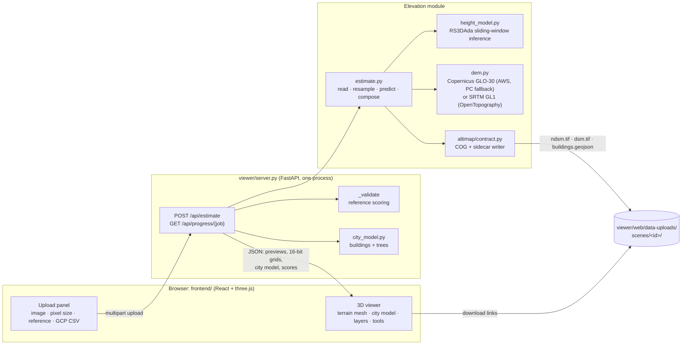

# AltiMap architecture

AltiMap turns one optical RGB image (aerial or satellite) into metric elevation models and an
interactive 3D scene. It is built for Smart India Hackathon 2026, problem statement 26175
("DepthWizard", ISRO); the brief and the organisers' FAQ are in
[`docs/problem-statement.md`](docs/problem-statement.md).

This document describes the system as it runs today: what each part does, how data flows
between them, the formats they exchange, the models and data behind them, and the measured
results and limits. [`SETUP.md`](SETUP.md) covers installation, and [`README.md`](README.md)
gives the short tour. [`CLAUDE.md`](CLAUDE.md) holds the working notes for contributors
(invariants, findings not to re-run). The design history lives in
[`docs/superpowers/`](docs/superpowers/): specs, plans, and spikes that record measurements.

## 1. What the brief asks, and where it lives

| Requirement (brief / FAQ) | Where it is met |
|---|---|
| PNG/JPG input → relative DSM (rDSM) | `viewer/estimate.py`: metric nDSM (height above ground) for any image; for non-georeferenced input it is the relative product |
| GeoTIFF input → absolute metric DSM | `viewer/estimate.py`: nDSM + SRTM (default) or Copernicus GLO-30, DEM-consistent (§4.3), written as a COG GeoTIFF |
| Pre-trained monocular depth backbone | RS3DAda: DINOv2 ViT-L encoder + DPT decoder (§5), fine-tuned by us on GAMUS |
| Scale calibration: low-res DEM, GCPs, scene statistics, semantic priors | Metric heights come from the model itself; the absolute level comes from the selected base DEM (§4.3); optional ground control points correct vertical offsets (§4.4) |
| DSM in a standard geospatial format | Float32 Cloud-Optimized GeoTIFF + JSON sidecar (§3) |
| Optical image draped on a 3D mesh, rendered with three.js | `frontend/` (React + three.js), §7 |
| First-person navigation; height and slope analysis from any viewpoint | Orbit/fly/walk modes, probe, two-point profile, slope layer, contours (§7.3) |
| Upload imagery; validate heights against reference data | Upload panel + reference scoring, per-class errors, scatter plot, error map (§6.2, §7.4) |
| Standalone, unified module with source and documentation | One server process serves the app and the API (§8); this repo |
| Works 0.35–10 m; scored as absolute DSM vs SRTM/Copernicus (FAQ) | Resampling to the model's 0.33 m, measured sweep 0.3–10 m (§9.3); DEM-consistent export (§4.3) |

## 2. System overview



The core modelling decision: **predict height above ground (nDSM) in metres from the image,
and take the absolute level from a public DEM**, instead of asking a depth network for absolute
scale. A nadir image carries almost no absolute-altitude cue, but it carries strong cues for
object heights (size, shadows, context). The reasoning is in
[`docs/superpowers/specs/2026-08-23-single-view-dsm-design.md`](docs/superpowers/specs/2026-08-23-single-view-dsm-design.md).

## 3. Data contracts

Everything the elevation module produces goes through `src/altimap/contract.py`:

- **Elevation raster**: single-band float32 GeoTIFF, 256×256 tiles, deflate with the
  floating-point predictor, **NaN as nodata** everywhere (never −9999, which silently corrupts
  statistics). Same grid (size, transform, CRS) as the input image.
- **Sidecar** (`<name>.json` beside the raster, `Sidecar` dataclass): `gsd_m`, `source_gsd_m`,
  `datum` (`"orthometric"` for the DSM: heights above the EGM2008 geoid on GLO-30, EGM96 on SRTM;
  `"relative"` for the nDSM; `"ellipsoidal"` is reserved and never produced), `vertical_unit`
  (`"m"`, enforced), `model_version`, `height_range_m`, `tile_overlap_px`, `dtm_source` (which
  DEM, how it was combined, and whether GCPs corrected it).
- **Per upload** (`viewer/web/data-uploads/scenes/<id>/`): `ndsm.tif` + `ndsm.json` (always),
  `dsm.tif` + `dsm.json` (georeferenced input with DEM coverage), `buildings.geojson` (footprint
  polygons with `height_m`; WGS84 lon/lat for georeferenced input, image pixels otherwise), and
  `meta.json` (the full record). The uploaded image itself is deleted after processing.

Datum matters: orthometric and ellipsoidal heights differ by tens of metres over India, so the
sidecar always says which one a file holds.

## 4. Elevation module (`viewer/estimate.py`)

`estimate(path, model, device, out_dir, gsd_m=None, tta=True, report=None, gcps=None, building_model=None, canopy_model=None, base_dem="srtm")`:

### 4.1 Reading the image
`read_image` opens anything GDAL reads (PIL as fallback):
- **Band selection** follows the file's colour tags (so BGR-ordered files are read correctly);
  untagged files use bands 1–3, and single-band imagery is repeated to grey RGB.
- **Other bit depths**: >8-bit or float imagery (e.g. 10/11-bit satellite data) is stretched
  between the 2nd and 98th percentile of *valid* pixels only.
- **Nodata** pixels (from the dataset mask) are excluded from that stretch. The model sees them
  as the scene's mean colour, and they come out as NaN in the outputs.
- **Height maps are rejected**: a single-band floating-point raster is almost certainly a
  height map, not a photo, so it is refused with `NotImageryError`, which tells the user to put
  it in the reference slot instead.

Pixel size comes from the GeoTIFF: metres, or degrees converted at the scene's latitude. The
user can also type it in. With neither, 0.33 m is assumed and reported as experimental; the
viewer does not present that scale as known physical truth.

### 4.2 Height model inference
- **Resampling and tiling** (`predict_scene`):
  - The image is resampled from its pixel size to the model's training resolution (0.33 m).
  - Scenes larger than one tile (3072 px at 0.33 m, ~1 km) are processed tile by tile. Each tile
    has a margin of half a model window (259 px) that is predicted for context but not kept.
  - Every part of a large scene is seen at full resolution, and memory stays bounded. Before
    this, anything wider than ~1.35 km was squeezed into 4096 px.
  - Only very wide coarse scenes, beyond 400 MP at 0.33 m (e.g. 50 km at 10 m), run at a
    coarser working resolution. That is reported as `work_gsd_m`.
  - Results are resampled back to the input grid.
- **Prediction**: `height_model.predict` runs 518 px windows (ViT patch 14) at half-window
  stride, blended with a feathered weight so seams don't show. Optional test-time augmentation
  averages four flips (the UI's *High* quality).
- **Outputs**: height in metres, clamped at 0 because height above ground is non-negative, and
  8 OpenEarthMap classes, mapped to GAMUS's 7.
- **Three models, by land cover** (`load_pipeline`, §5):
  - Height v1 everywhere.
  - Building pixels: 25% v1 + 75% v2 (`fuse_heights`), selected on full GAMUS validation and
    confirmed on the untouched test split plus a focused TTA check.
  - Tree pixels inside extensive forest: Meta CHMv2 canopy heights. "Forest" is ≥ 80 % canopy
    within 150 m (`forest_mask`).
  - v2 and CHMv2 are optional and kept on the CPU. They move to the GPU only while they run,
    so a 6 GB GPU holds one ViT-L at a time.

### 4.3 Absolute DSM: DEM-consistent composition
The organisers score GeoTIFF output against SRTM/Copernicus ("values must match DEM heights").
Both are radar *surface* models: they already contain buildings and canopy, blurred over 30 m
cells. So the export, on the base DEM (SRTM by default, GLO-30 on request), is

```
DSM = DEM − mean₃₀ₘ(nDSM) + nDSM
```

The measurements below were made on GLO-30, the base until 2026-10-04.

Averaged over any 30 m cell, the DSM reproduces the DEM. Within the cell, the model supplies the
detail: buildings, trees, streets. The DSM is then floored at the bare-earth estimate
(`compose_dsm`): where GLO-30 under-reads tall towers, keeping each cell's mean pushed the streets
between them below ground, down to −35 m in Philadelphia (15 % of pixels; 26 % in Pittsburgh).
Floored, RMSE against the 3DEP LiDAR DSM went 35.35 → 34.36 m (Philadelphia) and 5.04 → 4.77 m
(Pittsburgh), while agreement with GLO-30 in 30 m cells went 3.52 → 3.99 m and 0.62 → 0.92 m,
still inside GLO-30's own accuracy. Scenes without the problem (Namchi) are unchanged. In extensive forest the fine detail is left out, so the DSM
there is GLO-30's own surface. Under closed canopy both our model and CHMv2 place that detail
poorly (r ≈ 0.3 against LiDAR), and including it made the forest DSM worse than the DEM alone
(8.92 vs 8.53 m RMSE; with the rule, 8.63 m, and the other landscapes are unchanged). The ground DEM is read once per upload: the image extent
plus a 300 m margin, at the DEM's 30 m posting (`padded_dem`), then reprojected onto the image.
The read comes from the AWS Open Data copy of GLO-30 (`viewer/dem.py:glo30`: plain HTTPS tiles
named by their south-west corner, byte-identical to Planetary Computer's `cop-dem-glo-30`), with
Planetary Computer as fallback. Planetary Computer's URL-signing service stalled for 50–120 s at a
time, which made uploads take 2–3 minutes; with AWS the DEM step takes about 5 s. Without
coverage or network, the nDSM is still produced and the response carries `dsm_error`.

**Base DEM.** The brief names SRTM as its example DEM and the FAQ names both SRTM and Copernicus;
over the Himalaya they differ by 5–14 m (§9.6). The DSM sits on SRTM GL1 by default
(`viewer/dem.py:srtm`: 1 arcsec, EGM96, from OpenTopography's public copy over plain HTTPS, ~2 s a
tile); `base_dem="glo30"` (upload panel: *Base terrain*; CLI: `--base-dem glo30`) uses Copernicus
GLO-30 instead. Where SRTM has no coverage (beyond 60 N / 56 S) or cannot be read, the upload falls
back to GLO-30 and says so (`base_dem_fallback`).
Every GeoTIFF upload is then scored against **both** DEMs (`estimate.dem_agreement`): the DSM
averaged over each 30 m cell against that DEM, which is how GeoTIFF output is scored. The cell-mean composition matches the base before the bare-earth floor, bridge additions and
GCP corrections. Those changes can increase the cell error (the current city upload has 3.77 m
cell RMSE on SRTM). The other DEM shows the gap a score against it would carry.

The **3D view's terrain** is a separate, display-only bare-earth estimate. It is chosen by the
predicted building share, following a rule measured against USGS LiDAR bare earth on four scenes:

| Predicted building share | Bare-earth method for the view |
|---|---|
| ≥ 40 % | grey morphological opening of the selected base DEM, 300 m |
| ≥ 10 % | the same opening, 150 m (keeps hills) |
| < 10 % | Selected base DEM minus the model's heights |

**Bridges** (`viewer/bridges.py`, GeoTIFF input). The height model reads bridge decks as ground
(downtown Pittsburgh: 7.6 m LiDAR decks read as 0.1 m), and the land-cover map calls two thirds
of them water, so neither the heights nor the classes find them. OpenStreetMap maps bridges as
ways tagged `bridge=*`:
- **Fetch**: one Overpass query for the scene's box, tried on several public mirrors within 60 s
  (they are often busy), cached per area next to the DEM patches, so a scene keeps its bridges
  offline. No answer means no bridges, never a failed upload.
- **Deck**: width from the `width` tag, else lanes × 3.5 m + 1.5 m, else a default per road
  type. Ways that share an end node are one structure, and its open ends are where it lands.
  Each deck pixel takes the inverse-distance blend of the selected raw base DEM at those ends;
  where decks cross, the higher one is the visible surface.
- **Use**: laid over the finished DSM, and its height above the bare earth goes into the nDSM.
- **Measured** on 47,800 m² of deck in downtown Pittsburgh (`scripts/fetch_naip_scene.py`) against
  3DEP LiDAR with the GLO-30 base: deck RMSE 16.6 m (bias −12.7) → 9.0 m (bias −5.9); the whole scene 25.34 → 25.19 m.
  Raw GLO-30 at the ends beat the LiDAR ground at the ends (11.2 m): OSM bridge ways often stop
  where a raised approach continues. Adding the decks before the DEM-consistent step instead
  let the cell means pull them back toward the water (13.4 m). The remaining low bias is the
  rise of long spans between their ends.

**Embankments** (`viewer/embankments.py`, GeoTIFF input): levees (`man_made=dyke`), embankments
and dams/weirs from OpenStreetMap. They are terrain, but narrow: the bare-earth opening that takes
buildings out of GLO-30 erases them too. On the Baton Rouge Mississippi levee (LiDAR crest 14.3 m)
the 150/300 m openings read the crest 3.2/5.6 m low and raw GLO-30 1.95 m low. Within 25 m of each
mapped line (feathered over 20 m) the ground keeps raw GLO-30: crest RMSE 3.33/5.64 → 1.97 m, the
whole corridor 2.13/3.75 → 1.53/1.62 m, the other 97 % of the scene unchanged. The DSM's floor
rises with it. Each line's crest elevation (median raw GLO-30 along it) is reported in
`flood_defences` and drawn in 3D as a cyan band. Those measurements used GLO-30;
the current pipeline preserves and samples the selected base DEM, including SRTM.

### 4.4 Ground control points (optional)
`read_gcps` parses a CSV of lon, lat, height. A header row may name the columns in any order;
without one, the order is lon, lat, height.

`gcp_correction` compares each point inside the image with the **bare-earth ground**
estimate, since control points measure the ground. It does not compare with the DSM: along
streets, the DEM-consistent DSM carries each 30 m cell's street/roof balancing. The mean
difference is a single vertical offset, and it is added to `dsm.tif` and to the viewer's ground
only if both of these hold:

- it is at least **4 m**, beyond Copernicus GLO-30's own specified vertical accuracy, so it is a
  real offset such as a datum mix-up (GPS ellipsoidal vs EGM2008 heights differ by tens of metres
  over India);
- it predicts left-out points better than no correction.

Otherwise nothing is applied, and the response says why. It also reports the offset, the error at
the points before and after, and the leave-one-out error.

GCPs fix offsets, not model error. §9.2 shows why the rule is this strict.

## 5. Height model (`viewer/height_model.py`, `height_train.py`)

- **Architecture**: RS3DAda from SynRS3D (NeurIPS 2024): a DINOv2 ViT-L/14 encoder and a DPT
  decoder with two heads, height regression (metres) and 8-class segmentation. The model code
  comes from the SynRS3D repository (`viewer/cache/SynRS3D`, commit `ab5a485`); the DINOv2
  encoder code comes via `torch.hub`.
- **Why this backbone**: Depth Anything 3, a general monocular depth model, was measured first
  (see the DA3 spike doc). On nadir imagery it fits a tilted ground plane instead of reading
  relief (mean |row correlation| 0.77 over 28 images), and its output is relative depth, not
  metres. RS3DAda was trained for overhead height estimation and outputs metres directly.
- **Fine-tuning, v1** (`best.pth`, public at
  [Dilavesh/altimap-height](https://huggingface.co/Dilavesh/altimap-height)):
  - Data: GAMUS, 0.33 m aerial RGB with airborne-LiDAR nDSM and land cover over Washington DC,
    Philadelphia and New York.
  - Trainable parameters: BitFit (encoder biases only) plus the decoder and heads.
  - Loss: L1 + 0.5 × gradient-L1 + 0.2 × cross-entropy, on 518 px crops, in bf16.
  - Schedule: cosine on wall-clock time; the best checkpoint is kept by validation RMSE, and
    restarts can't overwrite a better one.
- **v2** (`v2/best.pth` in the same repo, used as `viewer/cache/best_v2.pth`; 6.5 h on an RTX
  A5000, best checkpoint at step 25,500):
  - Starts from v1 with the last 8 encoder blocks unfrozen.
  - Height-weighted L1 (a pixel at h metres counts 1 + h/10 times), against tall-building
    underestimation.
  - 30 % of samples from SynRS3D, whose synthetic scenes are rich in high-rises and hills.
  - 50 % of samples satellite-style degraded: 1.3–6× coarser, blur, haze, gamma, saturation,
    noise.
  - GAMUS test (500 tiles, TTA), v1 → v2:

    | | v1 | v2 |
    |---|---|---|
    | RMSE | 5.02 m | 4.55 m |
    | Correlation r | 0.833 | 0.864 |
    | Building RMSE | 8.28 m | 6.74 m |
    | Philadelphia building RMSE | 10.04 m | 8.04 m |

  - Out of domain it over-reads trees and ground, so the app uses it for buildings only
    ("Why three models", below).
- **Evaluation**: `height_eval.py` scores per city against `zero` and `train-mean` baselines.

### Why three models

The app combines three models. The numbers are from 3DEP airborne LiDAR on four NAIP scenes and
the 40 GAMUS val tiles (`viewer/dsm_eval.py`, one pass).

- **v2 alone generalises worse than v1**, despite better GAMUS test scores. Its height-weighted
  loss taught it to read everything taller: nDSM RMSE suburb 4.5 → 6.2 m, city 29.8 → 33.9 m,
  with a positive bias on trees and ground. But on buildings it is right where v1 isn't:

  | | LiDAR | v1 | v2 |
  |---|---|---|---|
  | Tallest objects, city (99.9th percentile) | 151 m | 66 m | 145 m |
  | Tallest objects, hills | 53 m | 28 m | 52 m |
  | Building bias, city | — | −22 m | −0.4 m |

- **Current building fusion is 25% v1 + 75% v2** on predicted building pixels, with v1
  elsewhere. It was selected after correcting GAMUS `-5 m` no-data masking and comparing fixed
  weights plus soft routing on all 859 validation tiles. Against the former 50/50 route:

  | Split / mode | 50/50 overall RMSE | 25/75 overall RMSE | 50/50 building RMSE | 25/75 building RMSE |
  |---|---:|---:|---:|---:|
  | Validation, 859 tiles | 2.7511 m | **2.7402 m** | 3.3352 m | **3.2763 m** |
  | Untouched test, 2,861 tiles | 3.7573 m | **3.6972 m** | 5.2308 m | **4.9934 m** |
  | Focused TTA, 24 tiles | 3.1690 m | **3.0916 m** | 5.1284 m | **4.9140 m** |

  The TTA ordinary-scene subset regressed only 0.04% overall, below the predeclared 2% stop rule.
  Soft probability routing did not beat the fixed rule strongly enough to justify production
  complexity.

- **The earlier 50/50 external LiDAR run** established why fusion is safer than v2 alone:

  | Building RMSE | v1 | Fused |
  |---|---|---|
  | City | 44.5 m | 41.9 m |
  | Hills | 5.2 m | 4.4 m |
  | Suburb | 2.87 m | 2.82 m |
  | GAMUS val | 2.57 m | 2.40 m |

  In that historical run, tallest objects rose to 104 m in the city and 40 m in the hills. The
  city's overall nDSM was 0.3 m worse; the hills improved (3.68 → 3.47 m). These are historical building-specific and tower-percentile figures; the current 25/75
  all-pixel external rerun is reported separately in §9.2.
- **Meta CHMv2** (DINOv3 satellite backbone, March 2026; `facebook/dinov3-vitl16-chmv2-dpt-head`,
  or its byte-identical public mirror `WEO-SAS/chm-meta-v2`; DINOv3 licence) reads forest canopy
  better than our model: tree-pixel RMSE 18.1 → 13.0 m, bias −15 → −7 m. It is worse on
  suburban and street trees (5.5 → 8.3 m), so it only replaces tree heights inside extensive
  forest. With the 150 m / 80 % rule:
  - forest nDSM 18.5 → 15.7 m;
  - city, suburb and hills identical;
  - a 30 m window instead would have cost the suburb 0.5 m.

The DSM's forest rule (§4.3) is independent of CHMv2 and applies even without it.

## 6. Server (`viewer/server.py`, FastAPI)

### 6.1 Endpoints

| Endpoint | Purpose |
|---|---|
| `POST /api/estimate` | The main path. Multipart: `file` (PNG/JPG/TIFF, ≤ 200 MB), optional `gsd` (m/px, 0.01–100), `reference` (height map: `.tif`/`.png`/GAMUS `.h5`), `reference_kind` (`ndsm`/`dsm`/`auto`, API default `auto`), `gcps` (CSV), `job` (progress id), `tta` (bool), `base_dem` (`srtm` default / `glo30`). Runs in a thread pool so the event loop keeps answering progress polls. Uploads run **one at a time** (`_ESTIMATE_LOCK`): the models are shared and v2/CHMv2 move between GPU and CPU in place, so overlapping uploads used to crash each other; a queued upload reports "Waiting for another upload to finish" |
| `GET /api/progress/{job}` | `{stage, progress}` while an estimate runs; the UI polls it every 400 ms |
| `GET /api/health` | Liveness |
| `POST /api/upload`, `POST /api/classify-static`, `GET/DELETE /api/uploads` | Legacy paths (DA3 depth, static land-cover preview) used by the old dashboards |
| `/` | The built React app (`frontend/dist`); `/dashboards/` the old vanilla dashboards; `/data-uploads/` the per-upload files |

Models load lazily on the first request, not at import. The height checkpoint is chosen in this
order: `ALTIMAP_HEIGHT_CKPT`, then `viewer/cache/best.pth`, then the stock RS3DAda weights.

### 6.2 `/api/estimate` response
- **Record**: pixel size (and whether it was assumed), shape, nDSM max/p99, DSM range,
  `base_dem` and datum, `dsm_error`, `gcp` (points used, model, errors), `dem_agreement` (30 m
  cell and per-pixel RMSE/bias/r against GLO-30 and SRTM, `null` for one that couldn't be read),
  timing, checkpoint, class pixel counts. Form field `base_dem`: `srtm` (default) or `glo30`.
- **Previews** (≤ 1024 px, data URIs): RGB, linear 8-bit height (`pixel/255 × max_m`), classes.
- **`grids`**: nDSM, ground and DSM as **16-bit** values on the viewer's 1025×1025 mesh grid
  (`geo.encode_grid16`, value = lo + u16/65535 × span). 8-bit previews step 0.1–0.3 m, which
  quantised slopes to ~13°; 16 bits step millimetres.
- **`terrain`**: ground and DSM relief PNGs for georeferenced input.
- **`city`**: the 3D city model (§6.3); `downloads`: links to the files of §3.
- **`bridges`**: `{source, ways, deck_m2}`, or `{source, error}` when OpenStreetMap was unreachable.
- **`flood_defences`**: `{source, n, items: [{kind, name, crest_m}]}` (or `error`); `embankments`:
  the crest lines in view coordinates.
- **`facilities`**: `[{kind, name, u, v, z}]` critical facilities in the scene (OpenStreetMap), with
  counts per kind in the record; `facilities_error` when OpenStreetMap was unreachable.
- **`validation`** + **`error`** (when a reference is attached):
  - Reference placement: reprojected onto the image grid by coordinates when both are
    georeferenced (`geo.warp_to_grid`), otherwise resampled.
  - What it's compared with: `reference_kind=ndsm` or `dsm` explicitly selects height
    above ground or absolute elevation. The viewer defaults to nDSM and exposes the choice
    beside the reference file. Older API clients default to `auto` (median-distance guess);
    this can be wrong near sea level. Absolute validation requires an available absolute DSM.
  - Scores: RMSE, MAE, Pearson r, building RMSE, bias, coverage, and RMSE/MAE/bias per
    land-cover class.
  - For the viewer: 1500 scatter pairs, and a signed error map PNG (blue = model low, red =
    model high, clipped at a round limit near the 95th percentile).

### 6.3 3D city model (`viewer/city_model.py`, display only)
Built on a grid of up to 2048 px from the nDSM and classes:
- **Separating buildings**: each blob of building pixels is cut into roofs, one seed per roof
  plateau, then a watershed over the height gradient. Touching row houses split at the step or
  dip between them.
- **One block per roof**: each roof is extruded to the median of its interior heights and is
  never banded into height levels. The model's heights fall off gradually at walls, across a
  facade seen at an angle and along its rows of windows; banding that slope into levels ≥ 2.5 m
  apart stood such roofs as staircases (the leaning towers of downtown Philadelphia showed it
  most). A tower on its podium still gets two blocks, because they are two plateaus. Speckle
  and pavement-height blobs are dropped.
- **Facades**: a slope steeper than 45° (measured over a storey, ~1.5 m, so window rows average
  out) and wider than 8 m that hangs below a roof belongs to that roof but doesn't count toward
  its height, so a tower keeps its roof height. On the real scenes this changes little
  (Philadelphia 43.23 → 43.21 m city-model RMSE vs LiDAR); the synthetic leaning-facade test
  is where it matters (60 m instead of a diluted median).
- **Outlines**: traced and simplified. `regularize` squares an outline off (rectangle or right
  angles) only when that moves ≤ 10 % of its area, because squaring everything cost footprint
  IoU 0.843 → 0.793.
- **Blocks**: each is extruded to the median of its interior heights, with base and top on the
  terrain and roof colour from the photo.
  Roof seeds require both ≥ 4 m² area and a ≥ 1 m interior radius when multiple seeds exist;
  long, narrow roof-edge streaks cannot seed their own wall-like blocks. This is a display
  filter, not a correction to the model's exported height predictions.
- **Trees**: one crown per canopy peak (≥ 3 m, peaks ≥ 5 m apart). Crown radius comes from the
  canopy extent, bounded by the tree's height; colour comes from the photo.
- **Critical facilities**: the building a facility stands in gets its kind's colour, and a map-pin
  badge floats 14 m above it (hospital H, clinic cross, fire flame, police star, schools a book,
  shelters a house), drawn on a canvas so it needs no font; the panel lists them by kind.
- **Flood defences**: a cyan band along each embankment crest.
- **Bridges**: OpenStreetMap decks (§4.3) as 1.5 m slabs, cut into pieces 0.5 m apart in elevation
  so a rising span is drawn at its own height along its length, with the river or road visible
  beneath. Clicking one opens a "Bridge" card. They are added after `buildings.geojson` is
  written, so that export stays buildings only.

The city model **never feeds the GeoTIFFs**. Regularising heights this way raised RMSE from 2.66
to 2.86–3.38 m on validation tiles, so the exports stay the model's raw output.

## 7. Viewer (`frontend/`, React + Vite + three.js)

Almost all of it is `frontend/src/main.jsx`; styles are in `blender.css` and `styles.css`.

### 7.1 Scene
- **Terrain**: a plane displaced by the 16-bit grid at true vertical scale × the exaggeration
  slider, with the RGB image draped on it. Its detail is chosen at load from the GPU
  (`pickMeshSegments`):
  - 1024×1024 segments (2M triangles) on capable GPUs;
  - 512×512 on software renderers, mobile GPUs and Intel integrated graphics, which also get a
    smaller shadow map;
  - `?detail=high|standard` overrides it.
- **Normals and shading**: normals are recomputed from the surface; steep faces get darker vertex
  colours; a directional sun casts PCF soft shadows.
- **Two modes**:
  - *City model*: the bare-earth terrain plus extruded buildings (`ExtrudeGeometry`, photo
    roofs, tinted walls) and instanced tree crowns and trunks.
  - *Exact DSM*: the model's raw per-pixel surface, which is what the GeoTIFF holds.
- **Ground display** (georeferenced City model): *Estimated terrain* retains the DEM-derived
  ground; *Flat ground* uses a zero-height display plane, building tops equal to their estimated
  nDSM heights, trees based at zero, and facility markers on the flattened roofs or ground.
  Bridge slabs retain their approximate clearance above the original local ground. Absolute
  flood-defence crest lines are hidden in this view, and picked buildings omit absolute roof
  elevation. GeoTIFFs and geographic probes/profiles remain original estimates; flat GLBs are
  labelled in their filenames and scene metadata. The control resets on a new image.
  This addresses visual street ramps left by urban contamination in coarse surface DEMs;
  it does not establish true street elevations or reconstruct oblique building facades.
  Rendering checks are recorded in [the viewer report](docs/evaluation/viewer-rendering-2026-10-04.md).
- **Catalog scenes** (GAMUS tiles in `frontend/public/`): LiDAR reference layers, not model
  output. They are restyled for looks and always labelled "LiDAR reference heights, not model
  output". Only uploads show model output, drawn faithfully in metres.

### 7.2 Layers
- **Surface**: relief shading.
- **Height**: height above ground on a jet ramp from 0 to the nDSM maximum. Roofs, walls and
  crowns switch to it too, and the legend's gradient is built from the same colour stops.
- **RGB**, **Classes**.
- **Slope**: degrees of the shown surface, 0–45°+.
- **Error**: model − reference, when validated.
- **Contour lines**: a shader overlay from a per-vertex elevation attribute, at an automatic
  round interval.

### 7.3 Navigation and analysis
- **Orbit**; **fly** with WASD/QE; **waypoint routes** that play as flythroughs.
- **Walk**: first person at 1.7 m on the ground (under canopy in Exact mode). WASD at 6 m/s,
  Shift ×4, drag to look; building cells block and you slide along walls.
- **Probe** (Measure + double-click): height above ground, elevation (EGM96 on SRTM, EGM2008 on GLO-30) and slope. A
  second double-click draws the **A→B height profile** with its length.
- **Building card** (click a building): height, ~floors (3.2 m each), footprint m², volume m³,
  roof elevation.
- **GLB export** of the whole scene, in metres.

### 7.4 Workstation and inspector tabs

The docked workstation uses bundled Barlow fonts, graphite/amber controls, light/dark themes,
and five keyboard-navigable tabs. Arrow keys, Home and End move between tabs. On narrow screens
(< 1001 px), the viewport sits above the scrollable inspector; stationary scenes redraw on resize.

| Tab | Controls and results |
|---|---|
| Image | Upload or GAMUS reference scenes; GSD, reference type, GCP file, quality, base DEM; progress and raster/GeoJSON downloads |
| View | City model / Exact DSM, layers, contours, vertical exaggeration and coverage |
| Measure | Height probe, A→B profile, PNG scale reprocessing and waypoint routes |
| Accuracy | RMSE/MAE/correlation, scatter, class errors, DEM agreement and GCP outcome |
| Context | OpenStreetMap bridges, flood defences and facilities, with empty/error messages |

The frontend can be deployed separately using `VITE_API_BASE` and `VITE_DEMO_CATALOG`.
Completed height uploads persist the complete API payload as `result.json`, including
textures, city geometry, elevation grids and validation. `viewer.demo_bundle` packages that
state with original raster downloads for a public HF dataset. **Demo scenes** loads these
prepared model outputs without inference; **Reference scenes** remains the GAMUS LiDAR
gallery. Health polling gates live uploads when the VM is offline. Asset URLs resolve against
their API or saved-result origin rather than the Vercel frontend. See [DEPLOYMENT.md](docs/DEPLOYMENT.md).

**Open image** and **Export** are in the top bar. Uploads start at 1× vertical scale. The
OpenStreetMap results belong to the active upload or prepared demo; selecting a reference
scene clears them.

- **Inputs**: image, optional pixel size, optional reference heights, optional GCP CSV, quality
  (High = 4-flip TTA, Fast = one pass), base terrain for GeoTIFFs (Copernicus or SRTM).
- **Progress**: a staged progress bar.
- **Results**: timing, surface max, DSM range, GCP result, the DSM's agreement with Copernicus
  and SRTM in 30 m cells, validation numbers, the scatter
  (model vs reference, with the 1:1 line), the per-class error table, class shares, and download
  links.

## 8. Deployment

- **One process**: `python -m viewer.server [--host 0.0.0.0] [--port 8000]` serves the built
  viewer and the API on the same origin. The frontend uses relative URLs, so the app works from
  any browser that can reach the server (a VM, an SSH tunnel).
- **Docker**: the `Dockerfile` builds the same process into one image with all weights baked in
  (`docker build -t altimap . && docker run --gpus all -p 8000:8000 altimap`). The frontend is
  built in a Node stage; versions are pinned to the development environment; `.dockerignore` is
  an allowlist (`src/`, `viewer/` without `cache/` and past uploads, `frontend/`). The image is
  ~12 GB (PyTorch with CUDA 7 GB, weights 4.3 GB); building needs ~35 GB free. Checked on the RTX
  3050 laptop: CUDA visible in the container, GLO-30 and SRTM reachable, an upload through v1 + v2.
- **Development**: `npm run dev` on :5173 proxies `/api` and `/data-uploads` to :8000.
- **Environments**, kept separate on purpose:
  - `.venv`: numpy/scipy/rasterio/pytest, no torch; all tests.
  - `.venv-da3`: adds PyTorch, runs the app and all model scripts.
  - `backend/.venv`: the legacy Django app.
- **Network needs**:
  - The first model load fetches the DINOv2 code. After that it loads from `~/.cache/torch/hub`
    without contacting GitHub: `torch.hub` otherwise checks GitHub's default branch on every
    load, with no timeout, and that hung model loading on a slow network.
  - GeoTIFF uploads read GLO-30 from AWS Open Data, falling back to Planetary Computer, and
    SRTM GL1 from OpenTopography (for the base DEM or the agreement score), and bridges from
    OpenStreetMap's Overpass API (cached per area).
  - The LiDAR benchmark reads 3DEP (cached after).
  - Every remote read times out after 60 s (GDAL HTTP options plus a default `requests` timeout,
    both set in `viewer/dem.py`), so a stalled Planetary Computer transfer ends as "Absolute
    DSM unavailable" with the nDSM still delivered, instead of hanging the upload.
- **Hardware**: a 6 GB NVIDIA GPU is enough for inference (RTX 3050 laptop tested). A 2000 px
  GeoTIFF at 0.6 m takes about 60–100 s end to end on *Fast* there: about 30 s per height-model
  pass (v1, then v2 when the scene has buildings), 5 s DEM, plus CHMv2 in forests. Without v2
  the upload is 42–51 s. *High* runs each model pass about 4× longer. Training used a 24 GB RTX
  A5000.
- **Browser**: mesh detail follows the GPU (§7.1). Measured on an Intel Raptor Lake iGPU: the
  automatic 513 mesh runs at 51–60 fps, the forced 1025 mesh at 30–38 fps; on software rendering
  5 vs 1.2 fps.

## 9. Evaluation and results

All scripts are in `viewer/`, and their numbers are reproducible.

### 9.1 Height model, GAMUS held-out test (500 tiles, 4-flip TTA)

| City | RMSE (m), fine-tuned | RMSE (m), zero-shot | Pearson r | Building RMSE (m) |
|---|---|---|---|---|
| Washington DC | 3.95 | 10.08 | 0.915 | 4.51 |
| New York | 3.95 | 7.17 | 0.855 | 3.20 |
| Philadelphia | 5.90 | 6.28 | 0.822 | 10.04 |
| **All** | **5.02** | **7.25** | **0.833** | **8.28** |

### 9.2 By landscape, against USGS 3DEP airborne LiDAR (`dsm_eval.py`, one pass, no TTA)

**Current pipeline, rerun 2026-10-04:** the 25/75 building blend, CHMv2 forest routing and
current DSM rules were scored on all four scenes with both bases. SRTM DSM RMSE is
38.87 / 4.28 / 6.24 / 7.44 m (city / suburb / hills / forest); GLO-30 DSM RMSE is
34.36 / 3.62 / 4.75 / 8.75 m. Both improve on DEM alone in the first three scenes;
forest remains slightly worse. SRTM city correction using eight LiDAR ground points
reduces held-out-pixel DSM RMSE to 37.18 m; other sites decline correction or lack
bare-ground points. Full RMSE, MAE, correlation, bias, scope and datum notes are in the
[current report](docs/evaluation/landscapes-2026-10-04.md) and
[raw metrics](docs/evaluation/landscapes-2026-10-04.json).

**Historical comparison:**

This table is the historical external benchmark with the former 50/50 building blend. It remains
domain-gap evidence; do not quote it as a rerun of the current 25/75 route.

The app's pipeline (v1, v2 on buildings, CHMv2 in forest; §5), with v1 alone in brackets:

| Scene (pixel size) | nDSM RMSE (predict-0 baseline) [v1] | nDSM bias [v1] | DSM RMSE (GLO-30 alone) [v1] | DSM r (GLO-30 alone) |
|---|---|---|---|---|
| Dense city, Philadelphia (0.3 m) | 30.1 m (42.4) [29.8] | −1.2 m [−6.8] | 35.0 m (36.3) [34.7] | 0.376 (0.272) |
| Suburb, Chevy Chase (0.6 m) | 4.5 m (6.5) [4.5] | +1.4 m [+1.3] | 3.97 m (4.02) [3.99] | 0.820 (0.796) |
| Hilly town, Pittsburgh (0.6 m) | 3.5 m (6.5) [3.7] | −0.4 m [−0.7] | 5.02 m (5.53) [5.04] | 0.941 (0.923) |
| Forest, Smoky Mountains (0.6 m) | 15.7 m (24.7) [18.5] | −10.8 m [−15.9] | 8.75 m (8.53) [9.03] | 0.992 (0.993) |

- **Where the model helps**: it beats the predict-0 baseline everywhere. It improves the absolute
  DSM over GLO-30 alone in the city, suburb and hills, and in the forest it is within 0.2 m of it.
- **Tall buildings in the historical 50/50 run**: the city's tallest objects (99.9th percentile)
  went from 66 m (v1) to 104 m; LiDAR says 151 m. The city's all-pixel error was 0.3 m worse:
  taller towers slightly out of place (NAIP's relief displacement) cost more than they gained.
- **Forest**: canopy bias went from −15.9 to −10.8 m, and the DSM came to within 0.2 m of GLO-30
  alone (it was 0.5 m worse).
- **GCPs** (8 LiDAR bare-ground points, scored on all other pixels): GLO-30 has no real vertical
  offset against LiDAR here, so any fitted correction mostly fits noise. Earlier rules made
  things worse:

  | Scene | Fitted against the DSM | Fitted against bare ground, with a tilted plane | Final rule |
  |---|---|---|---|
  | Dense city | 34.7 → 39.0 m | 34.7 → 34.1 m | declined (unchanged) |
  | Suburb | 4.11 → 4.15 m | 3.99 → 6.06 m | declined (unchanged) |
  | Hills | 5.11 → 5.44 m | 5.04 → 5.45 m | declined (unchanged) |
  | Forest | — | — | no bare ground to place points on |

  The final rule (offset only, ≥ 4 m, must beat no correction on left-out points) declines all
  three, and still corrects datum-sized offsets (tested).

### 9.3 By pixel size (same scenes, images block-averaged, LiDAR averaged to match)
- **The nDSM holds up to ~1–2 m**: suburb nDSM RMSE is 4.5 m at 0.6 m and 3.9 m at 1 m.
- **At 5–10 m it fades to "flat"**: bias approaches −(mean object height), and RMSE matches the
  predict-0 baseline. It degrades to nothing, not to noise.
- **The DSM stays within 0.1 m of GLO-30 alone at 5–10 m**, because the export is
  DEM-consistent and the model's detail averages out within each 30 m cell. Its gain over GLO-30
  shrinks from 0.6 m to 5 m.
- **Unknown pixel size**: a 0.6 m image uploaded as a PNG uses the explicitly labelled experimental
  0.33 m assumption and changed nDSM RMSE
  by −0.7 to +1.0 m (suburb 4.47 → 3.78, hills 3.68 → 4.06, forest 18.5 → 19.5 m), a modest
  effect.

### 9.4 3D city model, 40 GAMUS val tiles (`city_eval.py`)

| Metric | Value |
|---|---|
| Footprint IoU | 0.848 |
| Edge F1 (within 1 m) | 0.674 |
| Height RMSE on buildings (v1 + 25/75 v2 fused) | 3.05 m |
| Separate buildings | 2036 |

One block per roof (§6.3) against banding roofs into levels: IoU 0.843 → 0.848, edge F1 0.663 →
0.674, building height RMSE 2.87 → 3.05 m (a podium loses its own level when no step separates
it from the tower). City-model RMSE against 3DEP LiDAR: downtown Philadelphia 43.75 → 43.21 m,
Pittsburgh 5.44 → 5.75 m. Accepted for the display model because the staircases were the visible
failure; the GeoTIFFs are unaffected.

Raw building masks: ours IoU 0.854, which beats every public model we tested:

| Model | Footprint IoU |
|---|---|
| SAM 3 | 0.757 |
| Mask R-CNN (NAIP 0.6 m) | 0.403 |
| UNet++ (WHU) | ≤ 0.407 |
| DINOv3 UperNet (OSM) | ≤ 0.387 |

That comparison is on our training domain, and it holds at 0.6 m too.

### 9.5 Tiling (Pittsburgh, 2000 px at 0.6 m, vs LiDAR)

| Processing | nDSM RMSE | DSM RMSE | Mean height jump at tile edges |
|---|---|---|---|
| One pass | 3.461 m | 5.021 m | — |
| Default 3072 px tiles | 3.467 m | 5.021 m | 0.114 m |
| 1024 px tiles (stress test) | 3.455 m | 5.022 m | 0.193 m |

The typical jump between neighbouring pixels anywhere in the image is 0.135 m, so the default tile
edges are indistinguishable.

### 9.6 India: Sikkim, Maxar WorldView-2/3 (`viewer/dem_check.py`)

Historical GLO-30-base checks on three 1.2 km scenes, 0.37–0.49 m, 13–26° off-nadir, from `scripts/fetch_india_samples.py`. There is
no Indian LiDAR in this check, so the DSM is compared with the two public DEMs. These historical
SRTM comparisons used NASADEM; the current reader is SRTM GL1, so these figures are not a
rerun of the present SRTM route:

| Scene | vs Copernicus GLO-30, 30 m cells | vs SRTM (NASADEM), 30 m cells |
|---|---|---|
| Chungthang town | RMSE 1.13 m, bias +0.34 m | RMSE 15.5 m, bias +11.6 m |
| Chungthang forest | RMSE 1.34 m, bias −0.17 m | RMSE 16.1 m, bias +13.7 m |
| Namchi town | RMSE 0.85 m, bias −0.03 m | RMSE 8.3 m, bias +7.4 m |

- The pipeline runs cleanly on real Indian satellite imagery, including the 26° off-nadir scene.
- Heights are plausible:
  - buildings: median ~4 m, top 5 % 9–11 m (1–3 storey hill-town houses);
  - trees: median 5–10 m, top 5 % 16–21 m.
- The DSM matches Copernicus to ~1 m, as designed.
- **Copernicus itself sits 7–14 m above SRTM here** (radar penetration into canopy, and SRTM's
  errors on steep Himalayan slopes). A score against SRTM would carry that difference.
- For true accuracy in India, TALD is the dataset to get: aerial LiDAR over Thiruvananthapuram,
  released to Indian researchers by IIST.

## 10. Known limits

- **Very tall structures** were still low in the historical 50/50 external run: 104 m against
  151 m. v2 reached 145 m but over-read other land cover. The 25/75 external scene has now
  been rerun (§9.2), with city nDSM RMSE 31.58 m.
  Its tower percentile was not remeasured, so no new tower-height value is claimed.
- **Forest canopy** still reads ~11 m low after CHMv2. The forest DSM stays 0.2 m worse than GLO-30
  alone, since GLO-30 already holds the canopy surface.
- **Coarse imagery** (≳ 2 m): object heights fade and the model adds little detail to the selected base DEM
  (historical GLO-30 sweep in §9.3). The 30 m base limits terrain detail and absolute-level accuracy; GCPs can correct an offset,
  while a finer reference DEM is needed for finer terrain detail.
- **Base DEM**: the DSM follows SRTM by default (the brief's example DEM) and GLO-30 on request
  (§4.3). Over the Himalaya the two differ by 5–14 m (§9.6), and only the chosen one is matched,
  so a score against the other would carry that gap.
- **Training domain**: aerial imagery of three US cities. Cartosat-2S at 0.6 m over India is out
  of domain. The Sikkim scenes behave plausibly, but without Indian LiDAR their accuracy is
  unmeasured.
- **Speed**: two height-model passes per scene (plus CHMv2 in forests) roughly double the upload
  time on a 6 GB laptop GPU. Very large scenes run tile by tile and take minutes.
- **Internet**: uncached GeoTIFF processing reads GLO-30 (AWS, then Planetary Computer) and SRTM
  (OpenTopography) online.
  Complete reprojected patches are reusable from `viewer/cache/dem/` or `ALTIMAP_DEM_CACHE`.
- **Non-georeferenced input**: without a pixel size, 0.33 m is an experimental assumption and is
  reported as such. Heights stay metric, but
  footprint areas scale with the assumption.

## 11. Repository map

| Path | What |
|---|---|
| `src/altimap/contract.py` | Output contract: COG writer, `Sidecar`, datums |
| `viewer/estimate.py` | Elevation module: image → nDSM/DSM GeoTIFFs; GCPs; batch CLI |
| `viewer/height_model.py` | RS3DAda loading and sliding-window inference |
| `viewer/height_train.py`, `height_eval.py`, `gamus_dataset.py` | Fine-tuning, per-city evaluation, GAMUS loading |
| `viewer/city_model.py`, `city_eval.py` | 3D city model and its benchmark |
| `viewer/dsm_eval.py` | LiDAR benchmark by landscape and pixel size |
| `viewer/dem_check.py` | DSM vs Copernicus/SRTM for scenes without LiDAR (India) |
| `viewer/canopy.py` | CHMv2 forest canopy heights (optional) |
| `viewer/geo.py`, `dem.py` | Geo helpers (16-bit grids, reprojection), DEM reads (GLO-30, SRTM) |
| `viewer/server.py` | FastAPI app: API + static app |
| `frontend/` | React + three.js viewer |
| `Dockerfile`, `.dockerignore` | The whole app as one image, weights included (§8) |
| `viewer/osm.py` | Overpass queries: mirrors, time budget, per-area cache |
| `viewer/bridges.py` | Bridge decks from OpenStreetMap, heights from the terrain at their ends |
| `viewer/embankments.py` | Levees, embankments, dams: kept in the terrain, crest lines for the view |
| `viewer/facilities.py` | Critical facilities (hospitals, fire, police, shelters, schools) |
| `scripts/` | Training-data download, the unattended v2 training run, Indian and NAIP test scenes |
| `tests/` | Synthetic-fixture test suite (no GPU, no network) |
| `viewer/web/`, `viewer/export_*.py`, `refine*.py`, `validate.py`, `backend/` | Earlier DA3-based dashboards and exporters, the Django backend (legacy, kept working) |
| `docs/` | Problem statement, model card, design specs, plans, spikes |

## 12. Hardening notes

- `viewer/dem.py:glo30` and `srtm` cache complete reprojected patches in `viewer/cache/dem/` (or
  the `ALTIMAP_DEM_CACHE` directory), keyed by source. A missing or partially readable tile remains unresolved; it is
  not converted to a zero-elevation surface.
- `viewer/geo.py` reports rotated/sheared and materially non-square GeoTIFF grids. The absolute
  DSM path refuses those grids until a north-up reprojection path is added, avoiding incorrect
  geospatial output.
- `viewer/height_eval.py` reports pooled reference-height bins. `viewer/fusion_eval.py` provides
  the v1/v2 hard-weight and soft-building-routing ablation without changing production behavior.
