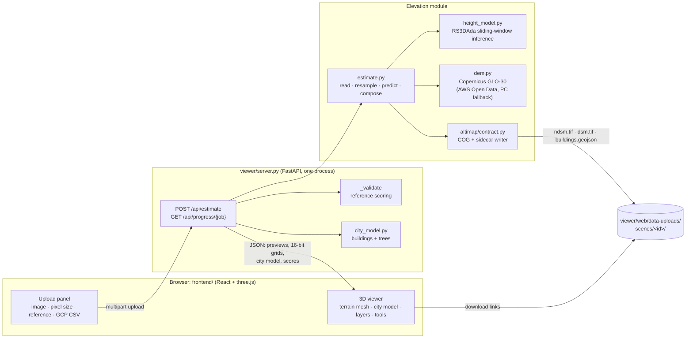

# AltiMap architecture

AltiMap turns one optical RGB image (aerial or satellite) into metric elevation models and an
interactive 3D scene. It is built for Smart India Hackathon 2026, problem statement 26175
("DepthWizard", ISRO); the brief and the organisers' FAQ are in
[`docs/problem-statement.md`](docs/problem-statement.md).

This document describes the system as it runs today: what each part does, how data flows
between them, the formats they exchange, the models and data behind them, and the measured
results and limits. [`SETUP.md`](SETUP.md) covers installation, and [`README.md`](README.md)
gives the short tour. [`CLAUDE.md`](CLAUDE.md) holds the working notes for contributors
(invariants, findings not to re-run). The design history lives in
[`docs/superpowers/`](docs/superpowers/): specs, plans, and spikes that record measurements.

## 1. What the brief asks, and where it lives

| Requirement (brief / FAQ) | Where it is met |
|---|---|
| PNG/JPG input → relative DSM (rDSM) | `viewer/estimate.py`: metric nDSM (height above ground) for any image; for non-georeferenced input it is the relative product |
| GeoTIFF input → absolute metric DSM | `viewer/estimate.py`: nDSM + Copernicus GLO-30 ground, DEM-consistent (§4.3), written as a COG GeoTIFF |
| Pre-trained monocular depth backbone | RS3DAda: DINOv2 ViT-L encoder + DPT decoder (§5), fine-tuned by us on GAMUS |
| Scale calibration: low-res DEM, GCPs, scene statistics, semantic priors | Metric heights come from the model itself; the absolute level comes from GLO-30 (§4.3); optional ground control points correct vertical offsets (§4.4) |
| DSM in a standard geospatial format | Float32 Cloud-Optimized GeoTIFF + JSON sidecar (§3) |
| Optical image draped on a 3D mesh, rendered with three.js | `frontend/` (React + three.js), §7 |
| First-person navigation; height and slope analysis from any viewpoint | Orbit/fly/walk modes, probe, two-point profile, slope layer, contours (§7.3) |
| Upload imagery; validate heights against reference data | Upload panel + reference scoring, per-class errors, scatter plot, error map (§6.2, §7.4) |
| Standalone, unified module with source and documentation | One server process serves the app and the API (§8); this repo |
| Works 0.35–10 m; scored as absolute DSM vs SRTM/Copernicus (FAQ) | Resampling to the model's 0.33 m, measured sweep 0.3–10 m (§9.3); DEM-consistent export (§4.3) |

## 2. System overview



The core modelling decision: **predict height above ground (nDSM) in metres from the image,
and take the absolute level from a public DEM**, instead of asking a depth network for absolute
scale. A nadir image carries almost no absolute-altitude cue, but it carries strong cues for
object heights (size, shadows, context). The reasoning is in
[`docs/superpowers/specs/2026-08-23-single-view-dsm-design.md`](docs/superpowers/specs/2026-08-23-single-view-dsm-design.md).

## 3. Data contracts

Everything the elevation module produces goes through `src/altimap/contract.py`:

- **Elevation raster**: single-band float32 GeoTIFF, 256×256 tiles, deflate with the
  floating-point predictor, **NaN as nodata** everywhere (never −9999, which silently corrupts
  statistics). Same grid (size, transform, CRS) as the input image.
- **Sidecar** (`<name>.json` beside the raster, `Sidecar` dataclass): `gsd_m`, `source_gsd_m`,
  `datum` (`"orthometric"` for the DSM, heights above the EGM2008 geoid like GLO-30/SRTM;
  `"relative"` for the nDSM; `"ellipsoidal"` is reserved and never produced), `vertical_unit`
  (`"m"`, enforced), `model_version`, `height_range_m`, `tile_overlap_px`, `dtm_source` (which
  DEM, how it was combined, and whether GCPs corrected it).
- **Per upload** (`viewer/web/data-uploads/scenes/<id>/`): `ndsm.tif` + `ndsm.json` (always),
  `dsm.tif` + `dsm.json` (georeferenced input with DEM coverage), `buildings.geojson` (footprint
  polygons with `height_m`; WGS84 lon/lat for georeferenced input, image pixels otherwise), and
  `meta.json` (the full record). The uploaded image itself is deleted after processing.

Datum matters: orthometric and ellipsoidal heights differ by tens of metres over India, so the
sidecar always says which one a file holds.

## 4. Elevation module (`viewer/estimate.py`)

`estimate(path, model, device, out_dir, gsd_m=None, tta=True, report=None, gcps=None)`:

### 4.1 Reading the image
`read_image` opens anything GDAL reads (PIL as fallback):
- **Band selection** follows the file's colour tags (so BGR-ordered files are read correctly);
  untagged files use bands 1–3, and single-band imagery is repeated to grey RGB.
- **Other bit depths**: >8-bit or float imagery (e.g. 10/11-bit satellite data) is stretched
  between the 2nd and 98th percentile of *valid* pixels only.
- **Nodata** pixels (from the dataset mask) are excluded from that stretch. The model sees them
  as the scene's mean colour, and they come out as NaN in the outputs.
- **Height maps are rejected**: a single-band floating-point raster is almost certainly a
  height map, not a photo, so it is refused with `NotImageryError`, which tells the user to put
  it in the reference slot instead.

Pixel size comes from the GeoTIFF: metres, or degrees converted at the scene's latitude. The
user can also type it in. With neither, 0.33 m is assumed and reported as assumed.

### 4.2 Height model inference
- **Resampling**: the image is resampled from its pixel size to the model's training resolution
  (0.33 m), capped at 4096 px on the long side, which bounds GPU memory. The results are
  resampled back to the input grid.
- **Prediction**: `height_model.predict` runs 518 px windows (ViT patch 14) at half-window
  stride, blended with a feathered weight so seams don't show. Optional test-time augmentation
  averages four flips (the UI's *High* quality).
- **Outputs**: height in metres, clamped at 0 because height above ground is non-negative, and
  8 OpenEarthMap classes, mapped to GAMUS's 7.

### 4.3 Absolute DSM: DEM-consistent composition
The organisers score GeoTIFF output against SRTM/Copernicus ("values must match DEM heights").
Copernicus GLO-30 is itself a *surface* model: it already contains buildings and canopy, blurred
over 30 m cells. So the export is

```
DSM = GLO-30 − mean₃₀ₘ(nDSM) + nDSM
```

Averaged over any 30 m cell, the DSM reproduces the DEM. Within the cell, the model supplies the
detail: buildings, trees, streets. The ground DEM is read once per upload: the image extent
plus a 300 m margin, at the DEM's 30 m posting (`padded_dem`), then reprojected onto the image.
The read comes from the AWS Open Data copy of GLO-30 (`viewer/dem.py:glo30`: plain HTTPS tiles
named by their south-west corner, byte-identical to Planetary Computer's `cop-dem-glo-30`), with
Planetary Computer as fallback. Planetary Computer's URL-signing service stalled for 50–120 s at a
time, which made uploads take 2–3 minutes; with AWS the DEM step takes about 5 s. Without
coverage or network, the nDSM is still produced and the response carries `dsm_error`.

The **3D view's terrain** is a separate, display-only bare-earth estimate. It is chosen by the
predicted building share, following a rule measured against USGS LiDAR bare earth on four scenes:

| Predicted building share | Bare-earth method for the view |
|---|---|
| ≥ 40 % | grey morphological opening of GLO-30, 300 m |
| ≥ 10 % | the same opening, 150 m (keeps hills) |
| < 10 % | GLO-30 minus the model's heights |

### 4.4 Ground control points (optional)
`read_gcps` parses a CSV of lon, lat, height. A header row may name the columns in any order;
without one, the order is lon, lat, height.

`gcp_correction` compares each point inside the image with the **bare-earth ground**
estimate, since control points measure the ground. It does not compare with the DSM: along
streets, the DEM-consistent DSM carries each 30 m cell's street/roof balancing. The mean
difference is a single vertical offset, and it is added to `dsm.tif` and to the viewer's ground
only if both of these hold:

- it is at least **4 m**, beyond Copernicus GLO-30's own specified vertical accuracy, so it is a
  real offset such as a datum mix-up (GPS ellipsoidal vs EGM2008 heights differ by tens of metres
  over India);
- it predicts left-out points better than no correction.

Otherwise nothing is applied, and the response says why. It also reports the offset, the error at
the points before and after, and the leave-one-out error.

GCPs fix offsets, not model error. §9.2 shows why the rule is this strict.

## 5. Height model (`viewer/height_model.py`, `height_train.py`)

- **Architecture**: RS3DAda from SynRS3D (NeurIPS 2024): a DINOv2 ViT-L/14 encoder and a DPT
  decoder with two heads, height regression (metres) and 8-class segmentation. The model code
  comes from the SynRS3D repository (`viewer/cache/SynRS3D`, commit `ab5a485`); the DINOv2
  encoder code comes via `torch.hub`.
- **Why this backbone**: Depth Anything 3, a general monocular depth model, was measured first
  (see the DA3 spike doc). On nadir imagery it fits a tilted ground plane instead of reading
  relief (mean |row correlation| 0.77 over 28 images), and its output is relative depth, not
  metres. RS3DAda was trained for overhead height estimation and outputs metres directly.
- **Fine-tuning, v1** (`best.pth`, public at
  [Dilavesh/altimap-height](https://huggingface.co/Dilavesh/altimap-height)):
  - Data: GAMUS, 0.33 m aerial RGB with airborne-LiDAR nDSM and land cover over Washington DC,
    Philadelphia and New York.
  - Trainable parameters: BitFit (encoder biases only) plus the decoder and heads.
  - Loss: L1 + 0.5 × gradient-L1 + 0.2 × cross-entropy, on 518 px crops, in bf16.
  - Schedule: cosine on wall-clock time; the best checkpoint is kept by validation RMSE, and
    restarts can't overwrite a better one.
- **v2** (training on an RTX A5000; results go to `v2/` in the same repo):
  - Starts from v1 with the last 8 encoder blocks unfrozen.
  - Height-weighted L1 (a pixel at h metres counts 1 + h/10 times), against tall-building
    underestimation.
  - 30 % of samples from SynRS3D, whose synthetic scenes are rich in high-rises and hills.
  - 50 % of samples satellite-style degraded: 1.3–6× coarser, blur, haze, gamma, saturation,
    noise. This targets 0.6 m Cartosat and the FAQ's 0.35–10 m range.
- **Evaluation**: `height_eval.py` scores per city against `zero` and `train-mean` baselines.

**Tree heights: Meta CHMv2 measured, not adopted.** Meta/WRI's Canopy Height Maps v2 (DINOv3
satellite backbone, March 2026; `facebook/dinov3-vitl16-chmv2-dpt-head`, DINOv3 licence) was
tested against 3DEP LiDAR, with its heights swapped in on our tree pixels:

| Scene | Tree-pixel RMSE, ours → CHMv2 | DSM RMSE, ours → with CHMv2 |
|---|---|---|
| Forest (76 % trees) | 18.1 → 13.0 m | 9.49 → 10.06 m |
| Suburb | 5.5 → 8.3 m | 4.10 → 4.96 m |
| Hilly town | 2.9 → 6.3 m | 5.06 → 5.20 m |
| Dense city | 6.6 → 7.6 m | 34.72 → 34.72 m |

- **Forest**: better canopy heights, but a worse DSM. The DEM-consistent export keeps each 30 m
  cell at the Copernicus value, so a model only adds within-cell variation. Both models place
  that variation poorly under canopy (r ≈ 0.2–0.3), so taller trees mean larger misplaced bumps.
- **Everywhere else**: worse than ours.

It is not a dependency.

## 6. Server (`viewer/server.py`, FastAPI)

### 6.1 Endpoints

| Endpoint | Purpose |
|---|---|
| `POST /api/estimate` | The main path. Multipart: `file` (PNG/JPG/TIFF, ≤ 200 MB), optional `gsd` (m/px, 0.01–100), `reference` (height map: `.tif`/`.png`/GAMUS `.h5`), `gcps` (CSV), `job` (progress id), `tta` (bool). Runs in a thread pool so the event loop keeps answering progress polls |
| `GET /api/progress/{job}` | `{stage, progress}` while an estimate runs; the UI polls it every 400 ms |
| `GET /api/health` | Liveness |
| `POST /api/upload`, `POST /api/classify-static`, `GET/DELETE /api/uploads` | Legacy paths (DA3 depth, static land-cover preview) used by the old dashboards |
| `/` | The built React app (`frontend/dist`); `/dashboards/` the old vanilla dashboards; `/data-uploads/` the per-upload files |

Models load lazily on the first request, not at import. The height checkpoint is chosen in this
order: `ALTIMAP_HEIGHT_CKPT`, then `viewer/cache/best.pth`, then the stock RS3DAda weights.

### 6.2 `/api/estimate` response
- **Record**: pixel size (and whether it was assumed), shape, nDSM max/p99, DSM range and
  datum, `dsm_error`, `gcp` (points used, model, errors), timing, checkpoint, class pixel counts.
- **Previews** (≤ 1024 px, data URIs): RGB, linear 8-bit height (`pixel/255 × max_m`), classes.
- **`grids`**: nDSM, ground and DSM as **16-bit** values on the viewer's 1025×1025 mesh grid
  (`geo.encode_grid16`, value = lo + u16/65535 × span). 8-bit previews step 0.1–0.3 m, which
  quantised slopes to ~13°; 16 bits step millimetres.
- **`terrain`**: ground and DSM relief PNGs for georeferenced input.
- **`city`**: the 3D city model (§6.3); `downloads`: links to the files of §3.
- **`validation`** + **`error`** (when a reference is attached):
  - Reference placement: reprojected onto the image grid by coordinates when both are
    georeferenced (`geo.warp_to_grid`), otherwise resampled.
  - What it's compared with: the absolute DSM or the nDSM, whichever it matches by median
    distance.
  - Scores: RMSE, MAE, Pearson r, building RMSE, bias, coverage, and RMSE/MAE/bias per
    land-cover class.
  - For the viewer: 1500 scatter pairs, and a signed error map PNG (blue = model low, red =
    model high, clipped at a round limit near the 95th percentile).

### 6.3 3D city model (`viewer/city_model.py`, display only)
Built on a grid of up to 2048 px from the nDSM and classes:
- **Separating buildings**: each blob of building pixels is cut into roofs, one seed per roof
  plateau, then a watershed over the height gradient. Touching row houses split at the step or
  dip between them.
- **Height levels**: each roof splits into levels ≥ 2.5 m apart, found from interior pixels so
  the soft ramp at walls doesn't make terraces. Speckle, thin slivers and pavement-height blobs
  are dropped or merged.
- **Outlines**: traced and simplified. `regularize` squares an outline off (rectangle or right
  angles) only when that moves ≤ 10 % of its area, because squaring everything cost footprint
  IoU 0.843 → 0.793.
- **Blocks**: each is extruded to the median of its interior heights, with base and top on the
  terrain and roof colour from the photo.
- **Trees**: one crown per canopy peak (≥ 3 m, peaks ≥ 5 m apart). Crown radius comes from the
  canopy extent, bounded by the tree's height; colour comes from the photo.

The city model **never feeds the GeoTIFFs**. Regularising heights this way raised RMSE from 2.66
to 2.86–3.38 m on validation tiles, so the exports stay the model's raw output.

## 7. Viewer (`frontend/`, React + Vite + three.js)

Almost all of it is `frontend/src/main.jsx`; styles are in `blender.css` and `styles.css`.

### 7.1 Scene
- **Terrain**: a 1024×1024-segment plane (2M triangles), displaced by the 16-bit grid at true
  vertical scale × the exaggeration slider, with the RGB image draped on it.
- **Normals and shading**: normals are recomputed from the surface; steep faces get darker vertex
  colours; a directional sun casts PCF soft shadows.
- **Two modes**:
  - *City model*: the bare-earth terrain plus extruded buildings (`ExtrudeGeometry`, photo
    roofs, tinted walls) and instanced tree crowns and trunks.
  - *Exact DSM*: the model's raw per-pixel surface, which is what the GeoTIFF holds.
- **Catalog scenes** (GAMUS tiles in `frontend/public/`): LiDAR reference layers, not model
  output. They are restyled for looks and always labelled "LiDAR reference heights, not model
  output". Only uploads show model output, drawn faithfully in metres.

### 7.2 Layers
- **Surface**: relief shading.
- **Height**: height above ground on a jet ramp from 0 to the nDSM maximum. Roofs, walls and
  crowns switch to it too, and the legend's gradient is built from the same colour stops.
- **RGB**, **Classes**.
- **Slope**: degrees of the shown surface, 0–45°+.
- **Error**: model − reference, when validated.
- **Contour lines**: a shader overlay from a per-vertex elevation attribute, at an automatic
  round interval.

### 7.3 Navigation and analysis
- **Orbit**; **fly** with WASD/QE; **waypoint routes** that play as flythroughs.
- **Walk**: first person at 1.7 m on the ground (under canopy in Exact mode). WASD at 6 m/s,
  Shift ×4, drag to look; building cells block and you slide along walls.
- **Probe** (Measure + double-click): height above ground, elevation (EGM2008) and slope. A
  second double-click draws the **A→B height profile** with its length.
- **Building card** (click a building): height, ~floors (3.2 m each), footprint m², volume m³,
  roof elevation.
- **GLB export** of the whole scene, in metres.

### 7.4 Upload and validation panel
- **Inputs**: image, optional pixel size, optional reference heights, optional GCP CSV, quality
  (High = 4-flip TTA, Fast = one pass).
- **Progress**: a staged progress bar.
- **Results**: timing, surface max, DSM range, GCP result, validation numbers, the scatter
  (model vs reference, with the 1:1 line), the per-class error table, class shares, and download
  links.

## 8. Deployment

- **One process**: `python -m viewer.server [--host 0.0.0.0] [--port 8000]` serves the built
  viewer and the API on the same origin. The frontend uses relative URLs, so the app works from
  any browser that can reach the server (a VM, an SSH tunnel).
- **Development**: `npm run dev` on :5173 proxies `/api` and `/data-uploads` to :8000.
- **Environments**, kept separate on purpose:
  - `.venv`: numpy/scipy/rasterio/pytest, no torch; all tests.
  - `.venv-da3`: adds PyTorch, runs the app and all model scripts.
  - `backend/.venv`: the legacy Django app.
- **Network needs**:
  - The first model load fetches the DINOv2 code. After that it loads from `~/.cache/torch/hub`
    without contacting GitHub: `torch.hub` otherwise checks GitHub's default branch on every
    load, with no timeout, and that hung model loading on a slow network.
  - GeoTIFF uploads read GLO-30 from AWS Open Data, falling back to Planetary Computer.
  - The LiDAR benchmark reads 3DEP (cached after).
  - Every remote read times out after 60 s (GDAL HTTP options plus a default `requests` timeout,
    both set in `viewer/dem.py`), so a stalled Planetary Computer transfer ends as "Absolute
    DSM unavailable" with the nDSM still delivered, instead of hanging the upload.
- **Hardware**: a 6 GB NVIDIA GPU is enough for inference (RTX 3050 laptop tested). A 2000 px
  GeoTIFF at 0.6 m takes 42–51 s end to end on *Fast* there: 30 s model, 5 s DEM, the rest DSM,
  city model and previews. *High* runs the model about 4× longer. Training used a 24 GB RTX A5000.

## 9. Evaluation and results

All scripts are in `viewer/`, and their numbers are reproducible.

### 9.1 Height model, GAMUS held-out test (500 tiles, 4-flip TTA)

| City | RMSE (m), fine-tuned | RMSE (m), zero-shot | Pearson r | Building RMSE (m) |
|---|---|---|---|---|
| Washington DC | 3.95 | 10.08 | 0.915 | 4.51 |
| New York | 3.95 | 7.17 | 0.855 | 3.20 |
| Philadelphia | 5.90 | 6.28 | 0.822 | 10.04 |
| **All** | **5.02** | **7.25** | **0.833** | **8.28** |

### 9.2 By landscape, against USGS 3DEP airborne LiDAR (`dsm_eval.py`, one pass, no TTA)

| Scene (pixel size) | nDSM RMSE (predict-0 baseline) | nDSM bias | DSM RMSE (GLO-30 alone) | DSM r (GLO-30 alone) |
|---|---|---|---|---|
| Dense city, Philadelphia (0.3 m) | 29.8 m (42.4) | −6.8 m | 34.7 m (36.3) | 0.388 (0.272) |
| Suburb, Chevy Chase (0.6 m) | 4.5 m (6.5) | +1.3 m | 3.99 m (4.02) | 0.817 (0.796) |
| Hilly town, Pittsburgh (0.6 m) | 3.7 m (6.5) | −0.7 m | 5.04 m (5.53) | 0.940 (0.923) |
| Forest, Smoky Mountains (0.6 m) | 18.5 m (24.7) | −15.9 m | 9.03 m (8.53) | 0.991 (0.993) |

- **Where the model helps**: it beats the predict-0 baseline everywhere, and it improves the
  absolute DSM over GLO-30 alone in the city, suburb and hills.
- **Weak spots**:
  - Tall buildings: Philadelphia's towers read far too low (City Hall ~72 m vs 167 m).
  - Forest: canopy reads 16 m low, leaving the DSM 0.5 m worse than GLO-30 alone.
- **GCPs** (8 LiDAR bare-ground points, scored on all other pixels): GLO-30 has no real vertical
  offset against LiDAR here, so any fitted correction mostly fits noise. Earlier rules made
  things worse:

  | Scene | Fitted against the DSM | Fitted against bare ground, with a tilted plane | Final rule |
  |---|---|---|---|
  | Dense city | 34.7 → 39.0 m | 34.7 → 34.1 m | declined (unchanged) |
  | Suburb | 4.11 → 4.15 m | 3.99 → 6.06 m | declined (unchanged) |
  | Hills | 5.11 → 5.44 m | 5.04 → 5.45 m | declined (unchanged) |
  | Forest | — | — | no bare ground to place points on |

  The final rule (offset only, ≥ 4 m, must beat no correction on left-out points) declines all
  three, and still corrects datum-sized offsets (tested).

### 9.3 By pixel size (same scenes, images block-averaged, LiDAR averaged to match)
- **The nDSM holds up to ~1–2 m**: suburb nDSM RMSE is 4.5 m at 0.6 m and 3.9 m at 1 m.
- **At 5–10 m it fades to "flat"**: bias approaches −(mean object height), and RMSE matches the
  predict-0 baseline. It degrades to nothing, not to noise.
- **The DSM stays within 0.1 m of GLO-30 alone at 5–10 m**, because the export is
  DEM-consistent and the model's detail averages out within each 30 m cell. Its gain over GLO-30
  shrinks from 0.6 m to 5 m.
- **Unknown pixel size**: a 0.6 m image uploaded as a PNG and treated as 0.33 m changed nDSM RMSE
  by −0.7 to +1.0 m (suburb 4.47 → 3.78, hills 3.68 → 4.06, forest 18.5 → 19.5 m), a modest
  effect.

### 9.4 3D city model, 40 GAMUS val tiles (`city_eval.py`)

| Metric | Value |
|---|---|
| Footprint IoU | 0.841 |
| Edge F1 (within 1 m) | 0.655 |
| Height RMSE on buildings | 2.99 m |
| Separate buildings | 2372 |

Raw building masks: ours IoU 0.854, which beats every public model we tested:

| Model | Footprint IoU |
|---|---|
| SAM 3 | 0.757 |
| Mask R-CNN (NAIP 0.6 m) | 0.403 |
| UNet++ (WHU) | ≤ 0.407 |
| DINOv3 UperNet (OSM) | ≤ 0.387 |

That comparison is on our training domain, and it holds at 0.6 m too.

## 10. Known limits

- **Tall structures** are underestimated (the long tail); v2 training targets this.
- **Coarse imagery** (≳ 2 m): object heights fade and the DSM falls back to GLO-30 (§9.3). GLO-30
  is itself only 30 m, so the absolute level can't be better than that without GCPs or a finer
  DEM.
- **Training domain**: aerial imagery of three US cities. Cartosat-2S at 0.6 m over India is out
  of domain; v2's degradation augmentation and SynRS3D data aim to narrow the gap. There is no
  Indian LiDAR test set here yet.
- **Scene size**: capped at 4096 px after resampling to 0.33 m; larger scenes lose detail (tiling
  is the upgrade path).
- **Internet**: GeoTIFF processing reads GLO-30 online (AWS, then Planetary Computer); there's
  no offline DEM option.
- **Forest DSM**: canopy heights read 16 m low, and within-cell detail makes the forest DSM 0.5 m
  worse than GLO-30 alone. Neither our model nor CHMv2 places canopy detail well enough (r ≈ 0.3).
- **Non-georeferenced input**: without a pixel size, 0.33 m is assumed. Heights stay metric, but
  footprint areas scale with the assumption.

## 11. Repository map

| Path | What |
|---|---|
| `src/altimap/contract.py` | Output contract: COG writer, `Sidecar`, datums |
| `viewer/estimate.py` | Elevation module: image → nDSM/DSM GeoTIFFs; GCPs; batch CLI |
| `viewer/height_model.py` | RS3DAda loading and sliding-window inference |
| `viewer/height_train.py`, `height_eval.py`, `gamus_dataset.py` | Fine-tuning, per-city evaluation, GAMUS loading |
| `viewer/city_model.py`, `city_eval.py` | 3D city model and its benchmark |
| `viewer/dsm_eval.py` | LiDAR benchmark by landscape and pixel size |
| `viewer/geo.py`, `dem.py` | Geo helpers (16-bit grids, reprojection), DEM reads |
| `viewer/server.py` | FastAPI app: API + static app |
| `frontend/` | React + three.js viewer |
| `scripts/` | Training-data download, the unattended v2 training run |
| `tests/` | Synthetic-fixture test suite (no GPU, no network) |
| `viewer/web/`, `viewer/export_*.py`, `refine*.py`, `validate.py`, `backend/` | Earlier DA3-based dashboards and exporters, the Django backend (legacy, kept working) |
| `docs/` | Problem statement, model card, design specs, plans, spikes |
