# AltiMap: one image to an interactive 3D city model

AltiMap is our working prototype for **SIH 2026 · SIH26175 · DepthWizard (ISRO)**.
Our main output is an interactive **3D city model with buildings, roof levels, trees and terrain**.
It starts with one aerial or satellite colour image. Our models estimate object heights and labels
such as buildings and trees. We use these predictions to create 3D shapes and place the original
image on the roofs and ground. For a suitable GeoTIFF, map coordinates help us add landscape
elevation. Height maps and error views help check the result. They are not the whole product.

**Tested height/API baseline:** [`84136c4`](https://github.com/ManasBytes/altimap/commit/84136c4013837f141624ed62a1d6cff80f52c05c).
Main also includes the newer viewer and prepared-demo update
[`5e21266`](https://github.com/ManasBytes/altimap/commit/5e21266f5a8bdef71d5a93c3b77c2058d6a4ebca).
That update does not change the Python height models or API. The accuracy tables and older UI
photographs below belong to the dated baseline checks. A separate
[local studio check on 5 October](docs/local-studio-verification-20261005.md) tested saved scenes,
viewer controls and a fresh GeoTIFF API request. It was not a complete browser upload/export test.
Other changes on `updated-dilavesh-new` remain separate and are not automatically included in main.
Screenshots show what the app can display. Accuracy must be checked against known heights on
images not used to train the model.

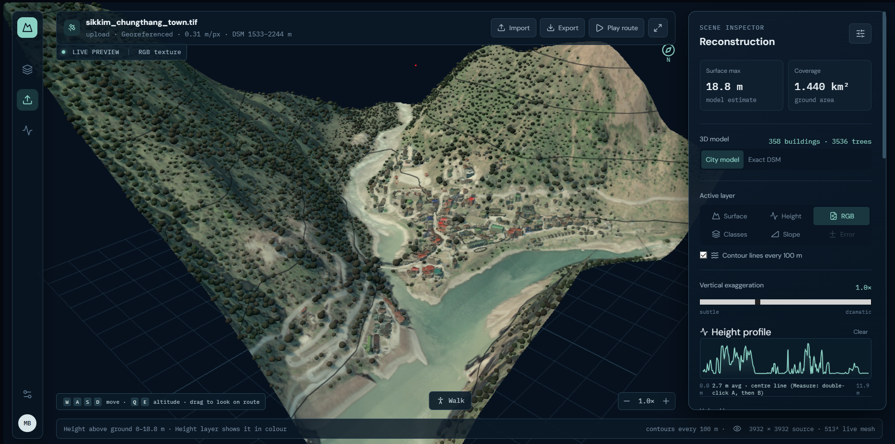

*Team capture, 4 October: Chungthang, Sikkim, 3,932 × 3,932 RGB GeoTIFF; city display at 1×.
The corresponding verified upload produced a DSM range of 1,533–2,244 m. No independent height
reference was supplied for this scene, so this image is reconstruction evidence, not an accuracy claim.*

[Setup and downloads](SETUP.md) · [How it works and simple definitions](ARCHITECTURE.md) ·
[Project journey](docs/PROJECT_JOURNEY.md) · [Evidence and screenshot provenance](docs/evidence/README.md) ·
[Model card](docs/model-card.md) · [Problem statement](docs/problem-statement.md)

[Hosted demo: saved scenes only](https://altimap-demo.vercel.app) · [Hosting and demo setup](docs/DEPLOYMENT.md)

Only the viewer and saved scenes are currently deployed. The public site lets you explore
previously generated 3D models, but **new TIFF, GeoTIFF, PNG and JPG uploads are not available there**.
To process your own image, run the local app with its Python inference server.
Prepared demos do not run a new model prediction. Publishing this documentation does not
redeploy the hosted site.

## Our journey in brief

We started with generic monocular depth and direct DEM rendering. The first gave unreliable overhead
height patterns; the second made good terrain but could not infer unknown buildings. Mark-1 added
prediction/reference/error inspection, and Biplab's work established the terrain workspace. Dilavesh's
RS3DAda height/semantic models then supplied learned object heights, with a building specialist and
an optional forest specialist. Validation selected today's **25% v1 + 75% v2 building blend**.

The current city view turns those outputs into separate buildings and tree crowns. Main now also
includes the studio inspector and prepared-scene hosting from the viewer update. Other teammate
experiments, including changes to DSM calculations, still need separate validation.
[Detailed branch history and historical screenshots](docs/PROJECT_JOURNEY.md).

## What we have built

| Capability | What works today |
|---|---|
| RGB input | PNG, JPG and optical RGB GeoTIFF upload, with processing progress |
| Height prediction | RS3DAda v1 adapted to our height task, plus an optional v2 building model |
| Land-cover prediction | Buildings, trees, roads, water, ground and low vegetation predicted from the colour image |
| GeoTIFF elevation | Absolute DSM composed using Copernicus GLO-30 or SRTM |
| 3D reconstruction | Original image draped on a height mesh; simplified roof blocks and tree crowns |
| Exploration | Orbit/zoom, WASD/QE flight, first-person Walk, waypoint flythrough |
| Analysis | Height and slope probes, A–B profiles, contours, class/height/error layers |
| Validation | Optional reference-height upload, RMSE/MAE/bias/correlation, per-class errors and scatter plot |
| Downloads | Height GeoTIFFs, files describing their units, building outlines and a 3D GLB model |
| Reliability | DEM cache/fallback, unresolved-data warnings, JSON-safe undefined metrics, optional secondary DEM comparison |

The application processes uploaded RGB; the built-in GAMUS **reference gallery is not model output**.
The forest specialist **Meta CHMv2** is supported when downloaded. It was **unavailable in our local
RTX 3050 upload verification**, so those forest screenshots/results must not be described as CHMv2 runs.

## Understanding the outputs

An RGB GeoTIFF normally contains **colour pixels, map coordinates, pixel placement and pixel size**.
Georeferencing does **not** mean it already contains a DSM or the height of every building.

- **nDSM:** height above the local ground. A 20 m building has an nDSM height of about 20 m.
- **DSM:** surface elevation of roofs, treetops and ground, using a stated height reference.
  If that building stands on ground at
  100 m elevation, its roof is conceptually at 120 m.
- **DTM / ground estimate:** ground elevation without buildings and trees. Our display ground is an
  estimate derived from coarse elevation data, not a surveyed high-resolution DTM.

| Input | Product and qualification |
|---|---|
| PNG/JPG + known pixel size | Predicted above-ground height in metres, local-grid 3D; no absolute geographic elevation |
| PNG/JPG + unknown pixel size | Relative/local reconstruction with an **experimental 0.33 m/pixel assumption**; displayed metres are not verified physical scale |
| Supported georeferenced RGB GeoTIFF | Predicted nDSM plus absolute DSM when the selected public elevation source is available |
| GeoTIFF with unavailable DEM or unsupported grid | nDSM retained, with an explicit absolute-DSM warning; no invented sea-level ground |

Saved height maps use decimal values in metres. Missing pixels have no value, represented as NaN.
They use a COG layout, which lets software read parts of a GeoTIFF efficiently.
Supported georeferenced outputs keep the input map system and pixel placement.
Rotated, sheared and strongly non-square image grids currently trigger warnings.
See [geospatial limits](SETUP.md#5-run-the-app).

## Current pipeline

```text
RGB image / optical RGB GeoTIFF
  │
  ├─ read image, valid pixels, CRS, affine transform and pixel size
  └─ resample for the height model; overlapping-window inference
       │
       └─ RS3DAda v1 → height above ground + predicted land-cover classes
            ├─ buildings → 25% v1 + 75% v2, when v2 is installed
            ├─ dense-forest trees → CHMv2, when installed and routing permits
            └─ otherwise → v1
                 │
                 ├─ PNG/JPG → local nDSM / relative reconstruction
                 └─ GeoTIFF → selected public DEM + estimated fine detail → absolute DSM
                                      │
                       ┌──────────────┴───────────────┐
                       │                              │
                 scientific rasters             display geometry
                 reference validation           textured mesh / city
                 GeoTIFF downloads              navigation / GLB export
```

### Height models and training

The main height model is **RS3DAda**, adapted from [SynRS3D](https://github.com/JTRNEO/SynRS3D).
Its DINOv2 image encoder reads patterns. Its DPT decoder turns them into height and class maps.
We adapted v1 using GAMUS colour images, measured heights above ground and class labels.

Training rewards accurate heights, clear height boundaries and correct class labels.
The technical loss is **height L1 + 0.5 × gradient L1 + 0.2 × semantic cross-entropy**.
The v2 specialist adapts more encoder blocks and uses height-weighted supervision and high-rise
training examples. Because it can overestimate unfamiliar ground/vegetation, it is routed to
**predicted building pixels only**. Uploading an image does not retrain either model.

CHMv2 is an optional canopy specialist routed to predicted tree pixels inside extensive forest:
at least 80% canopy in an approximately 150 m neighbourhood. It is not used indiscriminately on
suburban trees. Actual loaded models are listed with each result.

### How GeoTIFF metadata is used

The coordinate system, called the CRS, tells us how to read the map coordinates.
The transform tells us where the pixels are placed. Together they help find the pixel size,
fetch elevation for the right area and line up reference maps.
The model estimates object heights from **the colour image**.
It does not read hidden building heights from GeoTIFF metadata.

Copernicus and SRTM are coarse elevation sources, not alternative AI models. Their spacing is
approximately 30 m; they cannot directly describe every individual roof. Copernicus is itself a
surface model, already influenced by buildings and canopy. The main pipeline therefore approximates:

```text
absolute DSM ≈ selected DEM − local 30 m mean(predicted detail) + predicted detail
```

The local average uses a moving filter on our image grid, **not the exact original DEM cells**.
This keeps broad elevation while adding estimated detail. It does not guarantee exact agreement
with every DEM cell or surveyed building heights. We leave out fine forest detail where it was
unreliable. Ground used for the city display is estimated separately.

Copernicus uses the EGM2008 height reference; SRTM uses EGM96.
This reference is also called a vertical datum. Different references and capture dates can
affect a comparison with LiDAR laser measurements.
[Copernicus documentation](https://dataspace.copernicus.eu/explore-data/data-collections/copernicus-contributing-missions/collections-description/COP-DEM) ·
[USGS SRTM documentation](https://www.usgs.gov/centers/eros/science/usgs-eros-archive-digital-elevation-shuttle-radar-topography-mission-srtm)

### City view and height measurements

**City model is the primary presentation view.** It combines predicted classes, object heights and
estimated ground into recognizable buildings, roof levels and tree crowns, then maps the original
image onto the terrain and roofs. Connected building regions are separated into roof parts.
Heights inside each roof set how tall its block is. Higher points in tree regions help place tree crowns.
This is implemented in `viewer/city_model.py` and rendered in the React/Three.js viewer.

**Exact DSM is a separate check view:** a continuous height surface, not the same building/tree
shapes. “Exact” describes how it is drawn, not whether the heights are correct. The original height
maps remain the outputs used to measure error. The simpler display shapes do not replace them.
Roof/floor estimates and tree counts are estimates, not surveyed measurements. Vertical exaggeration
is display-only; use 1× when discussing physical proportions.

## Main result: the 3D city model

The gallery below shows **city geometry**, not only the Exact DSM surface. These are the supplied
team photographs, displayed directly rather than hidden in a collapsed section.

### Textured buildings and trees, up close

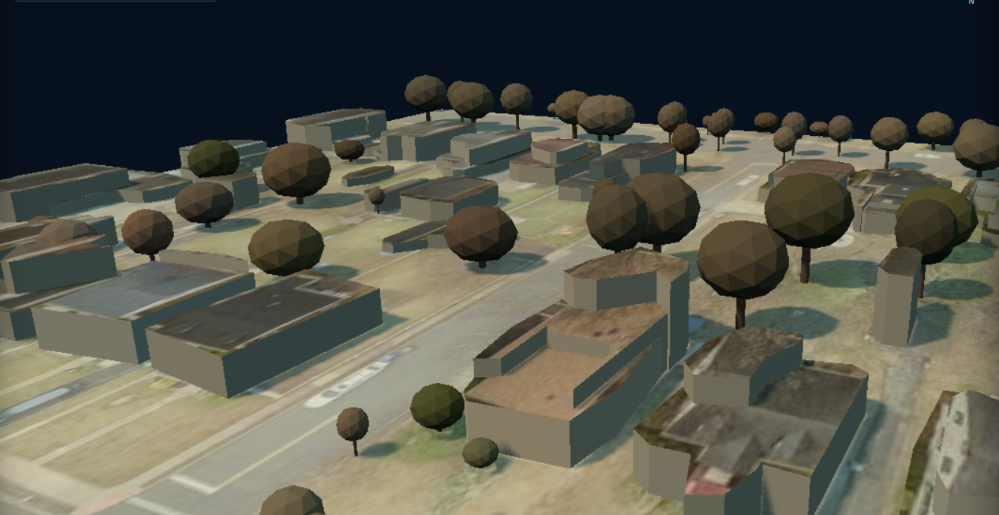

*Screenshot 203126: original imagery on the roofs and ground; simplified walls and tree crowns.
The cropped capture does not identify its input scene or reference, so it demonstrates geometry,
not independently established height accuracy.*

### The same city representation with classes and height colouring

| Class-layer city view · 203153 | Height-coloured city view · 203055 |
|---|---|
| 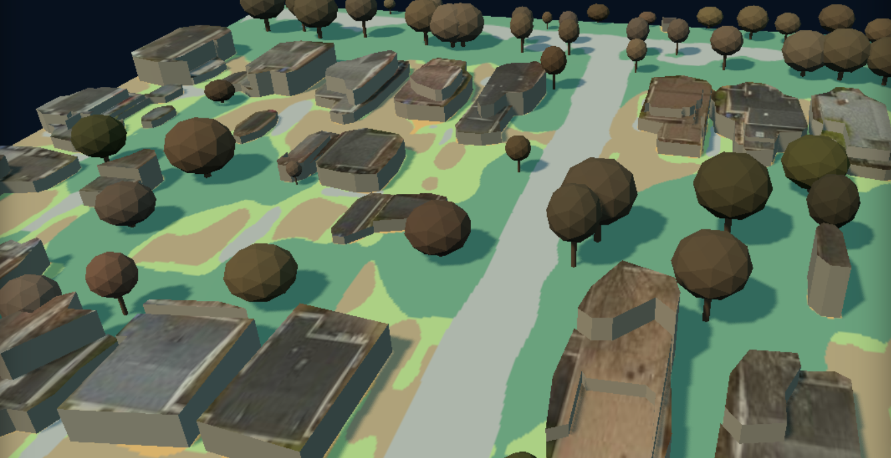 | 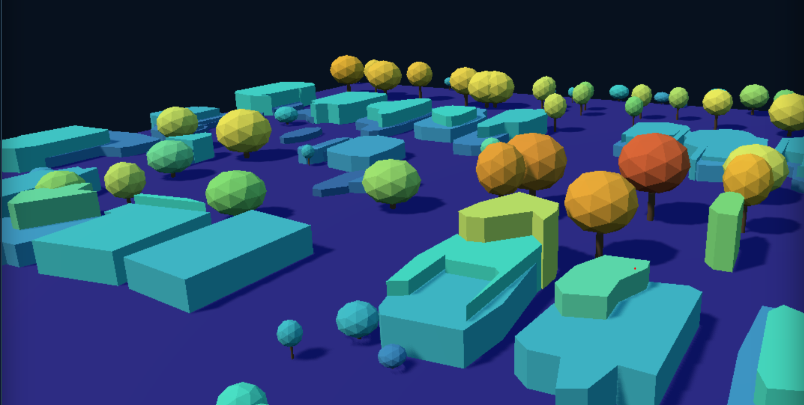 |

*The class view separates land-cover categories; the height view makes object-height variation
visible on the 3D geometry. The height screenshot is cropped without its legend, so colours alone
cannot be read as particular metre values. Use the live Height layer's scale for numeric interpretation.*

### GeoTIFF city model on real landscape relief

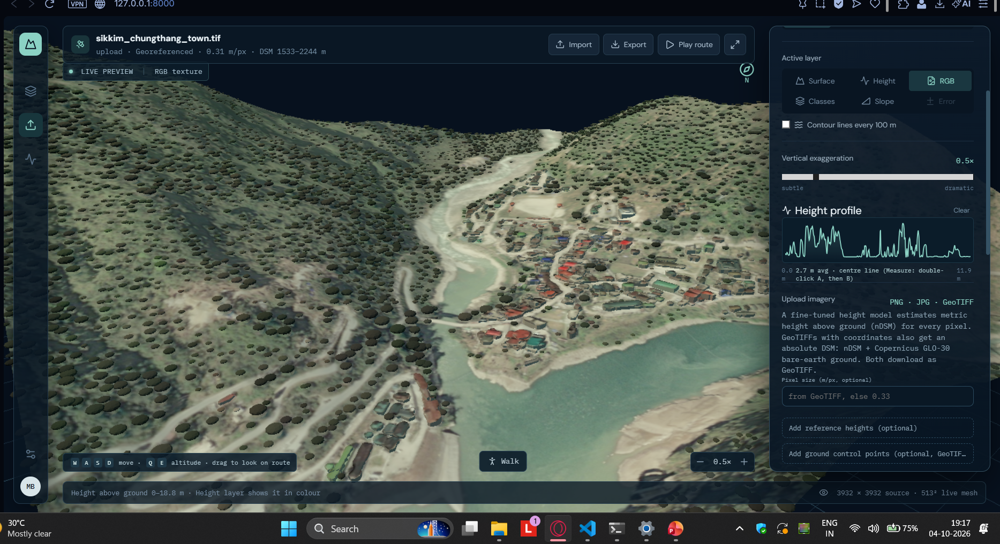

*Screenshot 191733: Chungthang GeoTIFF, city geometry over mountainous terrain, at 0.5× vertical
exaggeration. Screenshot 192448 is the 1× overview at the top of this README. No independent height
reference was supplied for this landscape.*

| Slope inspection · 192039 | Semantic city view · 192634 |
|---|---|
| 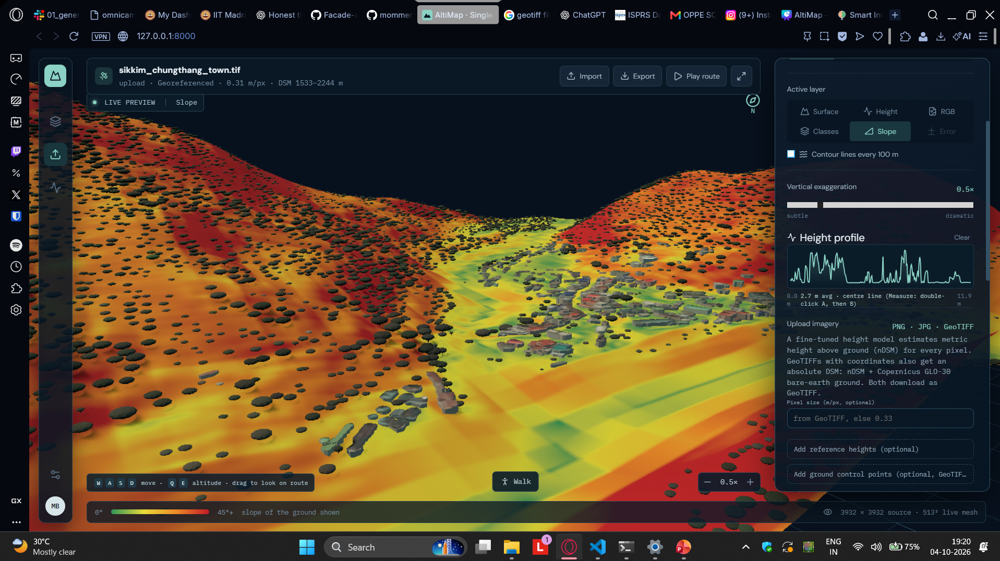 | 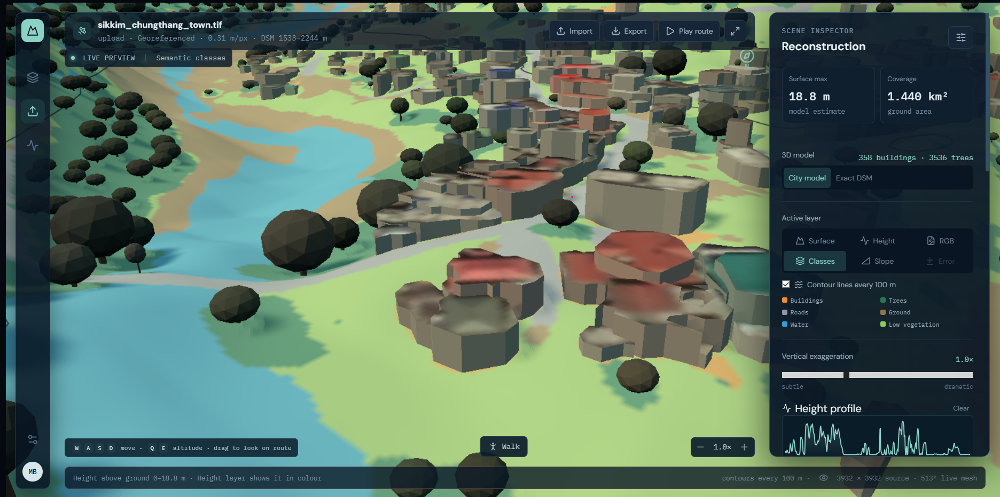 |

*Slope and class overlays are tools for inspecting the reconstructed landscape. They are not a
flood-risk forecast or supplied ground truth.*

### Plain-image reconstruction

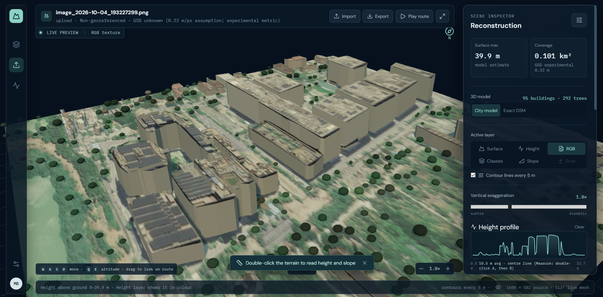

*Screenshot 193331: PNG input without coordinates or known GSD. The UI explicitly marks the 0.33 m/pixel
assumption as experimental. This demonstrates local reconstruction, not validated absolute heights.*

These supplied captures show the earlier validated viewer and predate the current studio layout.
Some contain older explanatory wording. The algorithm above describes the tested height/API
baseline; the current Scenes/View/Measure/Accuracy/Context tabs are explained in the hosting guide.

### New studio UI: light and dark themes

The following pictures were captured locally on 5 October using viewer commit `5e21266`.
The older black-UI pictures above are kept to show the working prototype and its journey.
Both new pictures show the **same saved Washington GAMUS prediction**, not two new inference runs.

| Light studio | Dark studio |
|---|---|
| 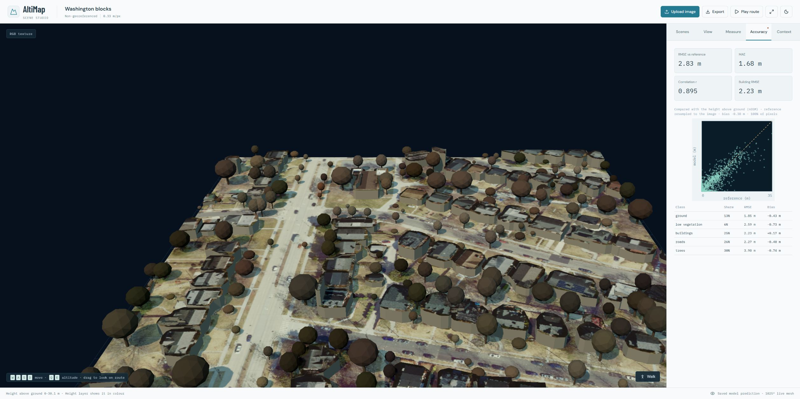 | 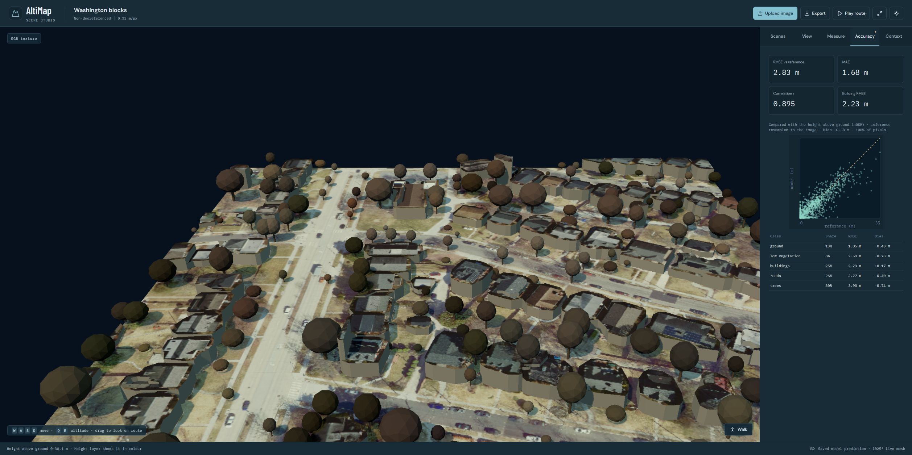 |

*The saved scene displays RMSE 2.83 m, MAE 1.68 m and building RMSE 2.23 m.
These are its saved reference scores, not a new benchmark or a claim about every image.
The hosted frontend can show saved scenes without a GPU. It currently does not process new
uploads; use the local Python inference server for those.
See the [local check and limits](docs/local-studio-verification-20261005.md).*

### Saved map context: experimental, not live detection

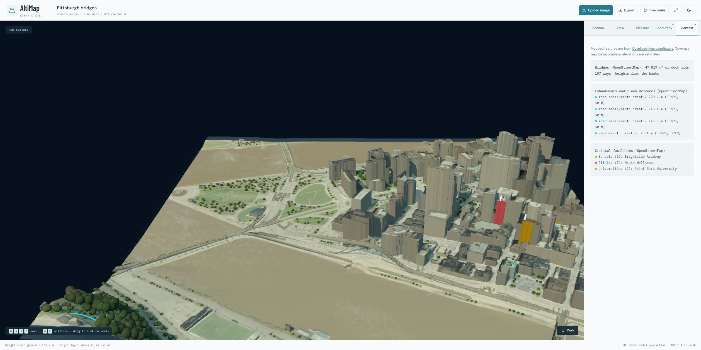

*Locally checked saved-demo display: Pittsburgh bridges, 5 October. School, clinic and university
names come from saved OpenStreetMap data. They are not detected from the image by our height model.
The viewer on main can display these saved fields, but main's Python upload pipeline does not yet
fetch this context for new images. No independent height reference is attached to this demo.*

We show this as a possible map-assisted extension, not a tested live-upload feature.
Adding or displaying a facility name does not prove that its building height is accurate.

### Newer teammate branch: experimental city-context view

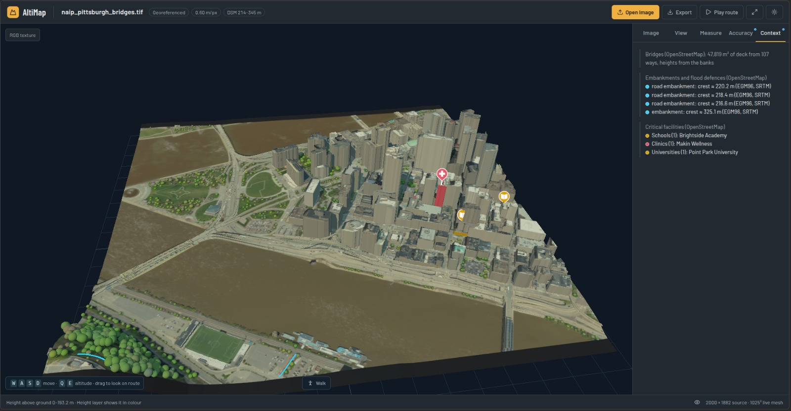

*Team-provided screenshot from newer `updated-dilavesh-new` work: `naip_pittsburgh_bridges.tif`,
0.60 m/pixel, displayed DSM range 214–345 m. Visible additions include the Context tab, mapped
bridge/embankment context and facility markers. This is **not tested main**. The exact capture commit
and independent height accuracy were not established; including this image does not merge or approve
all of its feature code. Main can now display prepared context through the newer studio, but that
does not mean the live Python estimator contains every newer branch calculation.
OpenStreetMap context is map-assisted, not a claim that our neural model detected
or accurately measured the bridges and facilities.*

## Supporting height and error diagnostics

These views explain and evaluate the underlying height estimate. They are **not substitutes for
the city-model gallery above**. Error metrics concern the raster prediction, not the decorative
shape of a tree crown or a simplified wall.

<details>
<summary>Open the height/class rasters and independent-reference DSM error view</summary>

### Predicted height and land-cover layers

| Height above ground | Predicted classes |
|---|---|
| 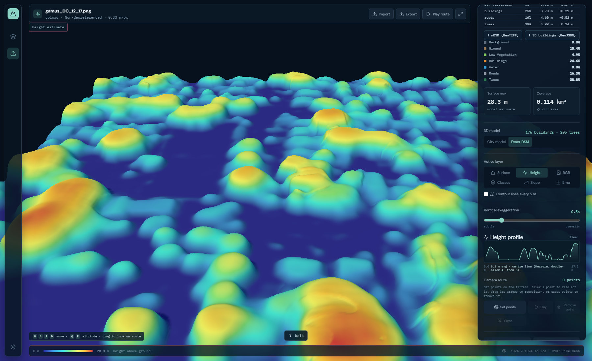 | 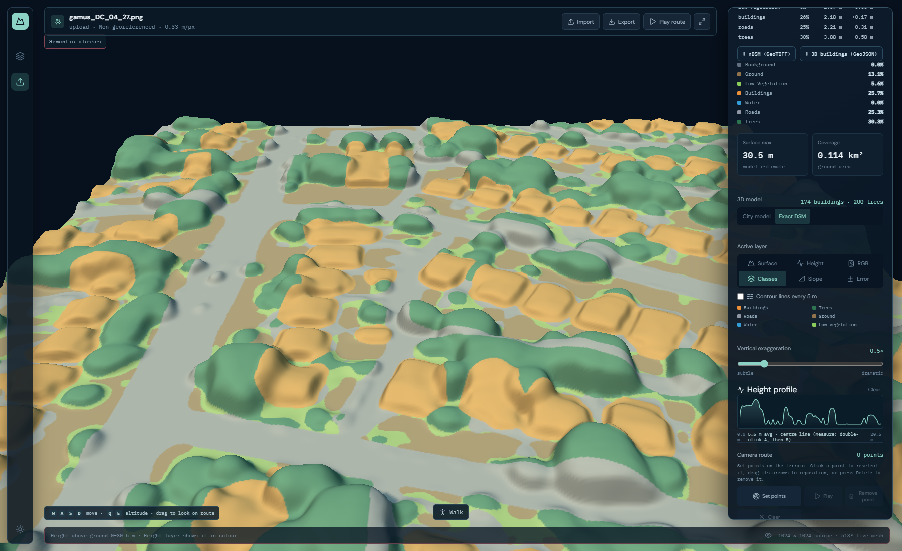 |

*Verified 4 October uploads. Left: DC_12_17 height map. Right: DC_04_27 classes. These are different
validation tiles, not a pixel-matched comparison; GAMUS upload spot checks are not the blind test benchmark.*

### Independent-reference error analysis

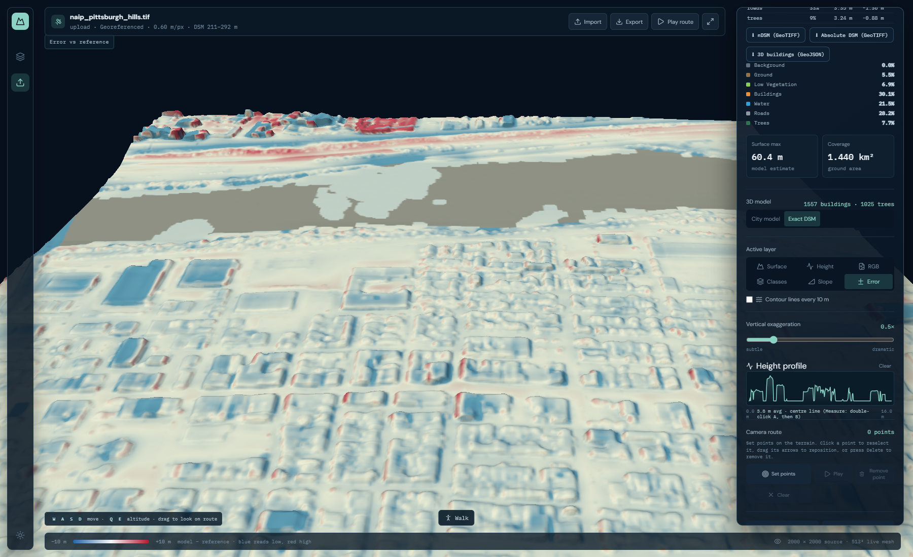

*Diagnostic DSM/error view, not the primary city presentation. Pittsburgh hills: absolute-DSM
RMSE 5.02 m, MAE 3.33 m, bias −2.39 m. Blue indicates too low, red too
high, and grey missing reference coverage. The full-raster metrics were independently recomputed.*

</details>

## Measured evidence

### GAMUS building-fusion experiment

The complete inventory contains **5,004 training, 859 validation and 2,861 test tiles** with matching
RGB, height and class files. Validation covers DC/Philadelphia; test covers DC/New York/Philadelphia.
The full dataset has 8,724 complete triplets.

We saved v1/v2 predictions and compared five fixed blends and five probability-based alternatives
on validation data. We then checked the selected rule on the separate test split.
Invalid GAMUS `−5 m` reference pixels were excluded.
These scores combine all valid pixels and compare **heights above ground from one-pass inference**.
They are not absolute-DSM scores or High/TTA results for the full dataset.

| Evaluation | Building route | Overall RMSE (m) | MAE (m) | Building RMSE (m) |
|---|---|---:|---:|---:|
| Validation · 859 tiles | Previous 50% v1 / 50% v2 | 2.7511 | 1.2948 | 3.3352 |
| Validation · 859 tiles | **Current 25% v1 / 75% v2** | **2.7402** | **1.2873** | **3.2763** |
| Test · 2,861 tiles | v1 only | 3.9623 | 1.5963 | 5.9289 |
| Test · 2,861 tiles | Previous 50% v1 / 50% v2 | 3.7573 | 1.5513 | 5.2308 |
| Test · 2,861 tiles | **Current 25% v1 / 75% v2** | **3.6972** | **1.5402** | **4.9934** |

Against the former blend, test RMSE improved **1.60% overall and 4.54% on buildings**.
This is a modest, measured improvement. It is not a new model or a guarantee for every image.
Probability-based routing did not show enough benefit to replace the fixed rule.

A separate **24-validation-tile four-flip TTA check** improved pooled RMSE from 3.1690 to 3.0916 m
and building RMSE from 5.1284 to 4.9140 m. The ordinary 16-tile subset regressed 0.04% in overall RMSE;
the tall eight-tile subset improved. The selected change adds no additional inference passes.

Proof: [validation CSV](docs/evidence/fusion-validation-corrected.csv) ·
[test CSV](docs/evidence/fusion-test-corrected.csv) ·
[TTA CSV](docs/evidence/fusion-tta24-all.csv) ·
[full evaluation summary](docs/evaluation/fusion-evaluation-summary.md) ·
[adoption report](docs/evaluation/BUILDING_FUSION_075_REPORT.md)

Building metrics here use **reference class labels**. The upload UI instead uses **predicted semantic
masks** to identify buildings; those two building scores must not be confused.

### Actual uploads on an RTX 3050 laptop

The dated checks covered **10 real browser uploads**. Seven included independent height references.
We checked **17 height downloads** for image size, pixel placement, map coordinates, file layout
and missing-data handling. We also checked that predictions were not flat.
The run used a **6 GB RTX 3050**, High quality and v1/v2. **CHMv2 was absent**.

| Scene | Reference comparison | RMSE (m) | MAE (m) | Bias (m) |
|---|---|---:|---:|---:|
| Chevy Chase suburb | LiDAR / absolute DSM | 3.96 | 2.90 | −0.79 |
| Pittsburgh hills | LiDAR / absolute DSM | 5.02 | 3.33 | −2.39 |
| Smoky Mountains forest | LiDAR / absolute DSM | 8.76 | 6.84 | +5.55 |
| GAMUS DC_04_27 | AGL / nDSM | 2.79 | 1.65 | −0.30 |
| GAMUS DC_12_17 | AGL / nDSM | 4.21 | 2.64 | −0.25 |
| GAMUS DC_15_17 | AGL / nDSM | 4.11 | 2.74 | −0.49 |
| Three Sikkim scenes | No independent height reference | N/A | N/A | N/A |

This table shows **selected examples**, not all upload results or an aggregate external benchmark.
The complete dated report and raw measurements remain linked below, including unsuccessful accuracy
cases. Successful processing is not uniformly accurate reconstruction; dense-urban errors remain
an improvement target. Reference vertical-datum and acquisition-date differences were not resolved
in these spot checks.

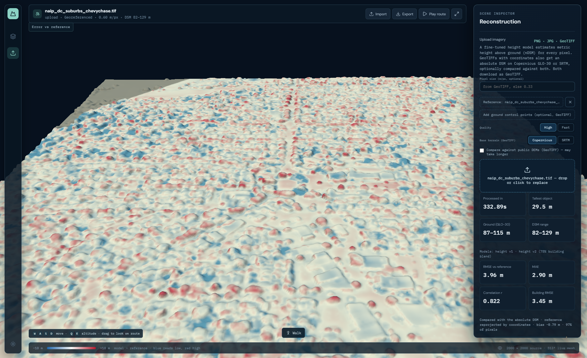

*Chevy Chase: 3.96 m absolute-DSM RMSE. The scatter compares reference elevation (horizontal) with
model elevation (vertical); the diagonal is perfect agreement.*

The application regression checks also cover flat DEMs, unavailable secondary DEMs, valid JSON
responses and optional comparisons. The 4 October report records **128 passing torch-free tests plus
12 passing API/loss tests in separate environments**, and a successful frontend build.
These are dated test results, not a claim that every newer branch has the same coverage.

[Upload verification and qualifications](docs/real-upload-verification-20261004.md) ·
[Complete measurements CSV](docs/evidence/real-upload-measurements-20261004.csv)

## Our journey: what changed and what we learned

Some branches tried ideas at the same time. They were not all tested in the same way.
Do not compare their scores as if they used the same images, data splits and quality settings.

| Stage | What it explored | What we learned / carried forward |
|---|---|---|
| Early depth experiments | Generic DA3 relative depth on overhead imagery | Strong artificial ramps/domain gap; relative depth alone was not defensible height |
| Direct GeoTIFF/reference rendering | RGB draped on real DEM, known-height mapped buildings | Good visualization and geospatial plumbing; reference reconstruction is not RGB-only height prediction |
| `Rishabh_prototype_Mark_1` · [97c078d](https://github.com/ManasBytes/altimap/commit/97c078d47474e7b7cd4c27a43aa711090526b137) | Frozen DAV2/RDAH path; 18 prepared GAMUS scenes | Raw RDAH collapsed in that setup; visible fallback used training-fitted height priors and supplied CLS labels |
| `biplab-feat` · [17a8016](https://github.com/ManasBytes/altimap/commit/17a801645481c46be0d5d4522b17e2968ec1590a) | Terrain workspace and a separate supervised U-Net surface model | Useful viewer and RGB/class/height integration; prepared reference previews are not inferred uploads |
| `dilavesh-new` · [c7142f9](https://github.com/ManasBytes/altimap/commit/c7142f9424b2213bcb096a3850ff1d3c196c8187) | RS3DAda metric height, v1/v2 specialists, optional CHMv2 | Task-specific supervision and selective specialist routing rather than raw depth as elevation |
| Tested production · [84136c4](https://github.com/ManasBytes/altimap/commit/84136c4013837f141624ed62a1d6cff80f52c05c) | Validated 25/75 fusion, real upload checks, API/viewer fixes | Current main; preserve measured baseline and its known limitations |
| Main viewer update · [5e21266](https://github.com/ManasBytes/altimap/commit/5e21266f5a8bdef71d5a93c3b77c2058d6a4ebca) | Studio inspector, prepared results and hosted frontend support | Included in main; height/API code unchanged, full viewer/GPU validation not repeated here |
| Newer teammate work · [e5837d0](https://github.com/ManasBytes/altimap/commit/e5837d0d25a13909785e3f6d1e43d37b7d83951d) | New inspector, prepared-demo hosting, scale tools and mapped context | Potential improvements; separate branch, limited smoke checks, not production-approved |

<details>
<summary>Historical screenshots and the newer experimental viewer</summary>

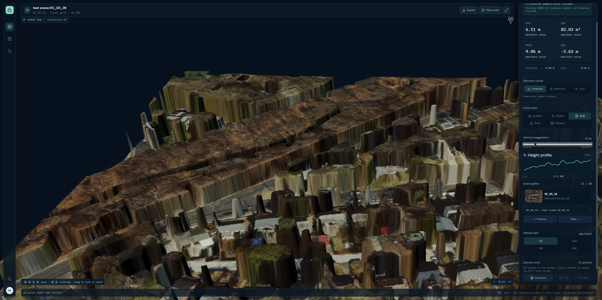

*Mark-1 replay, captured 5 October from exact snapshot 97c078d: DC_03_26. The UI identifies the
CLS-assisted fallback; it is not the raw RDAH prediction or an RGB-only inference result.*

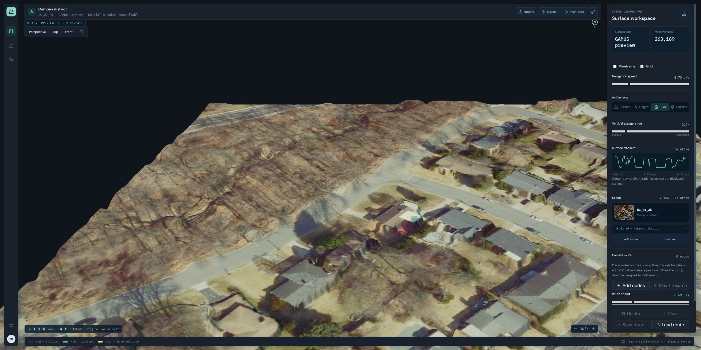

*Biplab snapshot 17a8016: prepared GAMUS reference preview. This captures the earlier visualization
work, not a fresh evaluation of its trained surface model.*

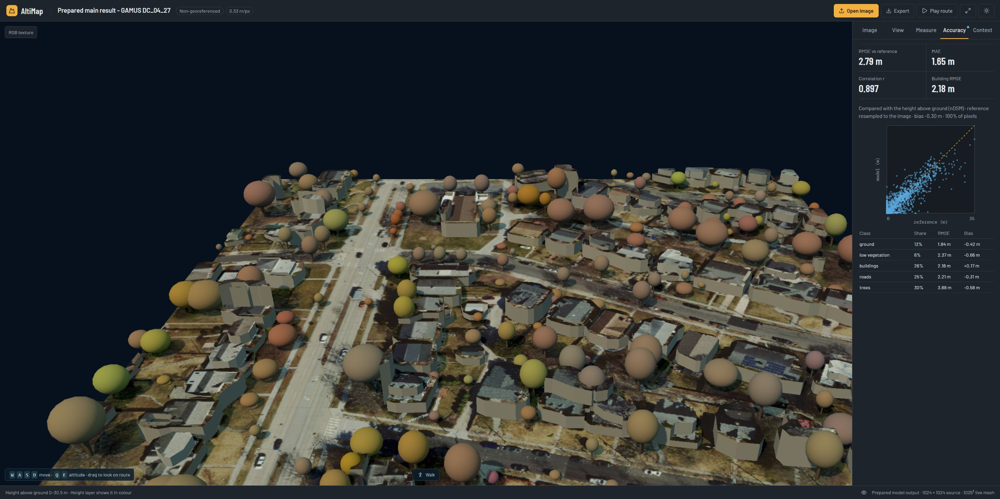

*Experimental snapshot e5837d0. We tested its saved-scene loader, texture/geometry rendering,
Accuracy/View tabs and orbit navigation using a previously verified main result. The displayed
metrics come from that saved main result. They are not a new accuracy result for this branch.
Live inference was deliberately disabled in this preview.*

The newer snapshot passed 141 non-GPU tests and built successfully during documentation checks;
Mark-1 passed 51 tests (one skipped), Biplab passed 52 (seven skipped). Passing unit tests does not
resolve the newer branch's missing production JSON-safety/opt-in comparison fixes or certify its
GeoTIFF accuracy. No experimental code was merged.

[Detailed chronology, historical test screenshots and limitations](docs/PROJECT_JOURNEY.md)

</details>

## How to use the interface

Set options and attach reference files **before choosing the input image**.
The current studio groups controls under Scenes, View, Measure, Accuracy and Context.
Scenes separates saved model demos, live uploads and the GAMUS reference gallery.

| Control | Meaning |
|---|---|
| Pixel size | Ground metres per pixel; read from a suitable GeoTIFF or supplied by the user |
| High / Fast | Same models; High averages original + three flipped predictions, Fast uses one pass |
| Copernicus / SRTM | Select the coarse elevation source for GeoTIFF absolute DSM; not an AI-model switch |
| Compare against public DEMs | Off by default; optional agreement with both sources, which may add network time |
| Add reference heights | Independent metre-valued height raster/HDF5 for evaluation, not another RGB photo |
| Add ground control points | CSV `lon,lat,height` of known ground elevations; may correct a consistent vertical offset |
| DSM range | Minimum/maximum absolute surface elevation, not building-height range |
| Height / Surface / RGB / Classes | Colour-coded object height, shaded surface, original texture, predicted land cover |
| Error / Slope / Contours | Signed reference error, surface steepness and elevation/height contour visualization |
| City model / Exact DSM | Simplified display objects versus raster height-field geometry |
| Vertical exaggeration | Display-only height multiplier; use 1× when discussing physical proportions |

**MAE** is the average absolute error. **RMSE** penalizes large mistakes more strongly.
**Bias** is the signed average error; negative means too low. **Building RMSE** evaluates only building
pixels. **Correlation** measures pattern agreement, not proof of correct absolute values.
“85% of pixels” means valid evaluation coverage, not 85% accuracy.

Reference plots show sampled pixel pairs: reference on the horizontal axis, model on the vertical;
below the diagonal means underestimation. Metrics use all valid overlapping pixels, not just plotted dots.
Main currently infers whether an uploaded reference is nDSM or absolute DSM; check the comparison label.
Ordinary coloured height screenshots are not valid metre-valued reference rasters.

Matching a public DEM used to build the DSM is **not an independent check of building heights**.
Ground control points are known ground elevations, not roof heights. They must use a compatible
height reference. The current correction shifts all elevations by one amount; it does not replace
an independent accuracy check.

## Run the tested version

Follow [SETUP.md](SETUP.md) for prerequisites, weights, the native Windows/Linux path and troubleshooting.
Model weights and bulk imagery are downloaded separately; they are not stored in Git.

Existing Docker workflow:

```bash
git clone --branch main https://github.com/ManasBytes/altimap.git
cd altimap
docker build -t altimap .
docker run --gpus all -p 8000:8000 altimap
```

Open **http://localhost:8000**. GPU Docker requires NVIDIA container support and sufficient disk.
The Dockerfile exists, but the Windows verification did **not** rebuild/run Docker because its daemon
was unavailable. See the dated setup notes rather than treating this as a fresh container certification.

For an already configured native environment:

```powershell
# Windows, repository root
cd frontend
npm ci
npm run build
cd ..
.\.venv-da3\Scripts\python.exe -m viewer.server
```

Models load lazily on first inference. The legacy health endpoint's `model_loaded` field describes the
old depth-model instance, not whether the current height stack has been loaded. Check actual upload
results and their model provenance.

## Next steps: compare models on the same data

**Planned research, not implemented in main.** Preserve the current models as Candidate A and keep
production stable until a candidate wins on the same evidence.

| Candidate | Why test it | Status / decision gate |
|---|---|---|
| **A · current AltiMap** | v1 + 75% building-specialist contribution + optional CHMv2 | Measured baseline; record which specialists are actually installed |
| **B · RDAH-Net** | RGB combined with a relative-depth prior and a learned height mapping | Revisit preprocessing/domain adaptation after the early Mark-1 failure; train/evaluate fairly |
| **C · Depth2Elevation** | Depth Anything features with scale modulation for remote-sensing height | Reproduce with the same supervision and holdout, subject to implementation/compute availability |
| **D · DINOv3 satellite features + height/semantic decoder** | Test satellite-domain representations | Future backbone experiment; frozen backbone first, not a claimed current general-height model |
| **Other lightweight/specialist candidates** | Alternative tall-building or efficient height estimators | Only benchmark usable, appropriately licensed implementations; no automatic adoption |

Research references: [RDAH-Net paper](https://www.mdpi.com/2072-4292/18/7/1024) and
[official implementation](https://github.com/Elenairene/RDAH-Net);
[Depth2Elevation paper and accepted manuscript](https://openrepository.aut.ac.nz/items/4d5713c5-f7ea-4a08-9a73-4c2555e29743);
[DINOv3](https://github.com/facebookresearch/dinov3).

Execution priorities:

1. **Freeze a reproducible benchmark:** fixed RGB/reference pairs, known GSD, valid-data masks,
   city-disjoint development/final-check scenes, and the same evaluator.
2. **Compare raw nDSM first:** overall/building/tree RMSE, MAE, bias, correlation and height bins
   0–2, 2–5, 5–10, 10–20, 20–50 and >50 m. Report counts, latency and VRAM.
3. **Stress-test generalization:** Cartosat-like 0.6 m imagery and resolution sweeps across
   0.35–10 m, without pretending upsampling restores lost roof detail.
4. **Evaluate absolute DSM separately:** DEM-only versus model-assisted DSM, vertical-datum handling,
   dense-urban ground errors and safer native-grid fusion.
5. **Validate changes from the newer branch selectively:** API failure paths, geospatial units,
   navigation, context reliability and measured raster effects before adoption.
6. **Improve deployment evidence:** independently rerun the full specialist stack and container setup,
   then save matched RGB/reference/prediction/error/3D examples.

Do not rank candidates using published numbers from different datasets/splits. Optional ensembles,
fine-tuning or routing changes must beat the fixed baseline without hidden reference-label inputs
or tuning on the final-check set.

## Repository guide and limitations

| Location | Purpose |
|---|---|
| `viewer/` | Current FastAPI app, height models, DEM composition, evaluation and city generation |
| `frontend/` | Current React/Three.js viewer and prepared reference-gallery assets |
| `tests/` | Unit and upload-regression tests; synthetic tests check correctness, not model accuracy |
| `scripts/` | Data/model preparation and evaluation helpers |
| `docs/evidence/` | Small shareable measured reports and screenshot provenance |
| `docs/evaluation/` | Detailed fusion decision and impact reports |
| `backend/`, `src/`, `spikes/`, older dashboards | Earlier implementations/research preserved for reproducibility; not the current launch path |

Key limits remain domain shift, tall buildings, sparse/forest canopy, coarse DEM ground accuracy,
unknown PNG scale, unsupported affine grids, acquisition/datum mismatches and network dependence.
Rendered tree shapes and roof blocks are simplified; smooth appearance is not proof of accurate heights.
Large scenes can take minutes on a laptop GPU.

Upstream work and dataset licences matter. Keep the supplied notices with distributed weights;
the v2/SynRS3D path includes non-commercial restrictions and CHMv2 carries the DINOv3 licence.
See [THIRD_PARTY_NOTICES.md](THIRD_PARTY_NOTICES.md).
