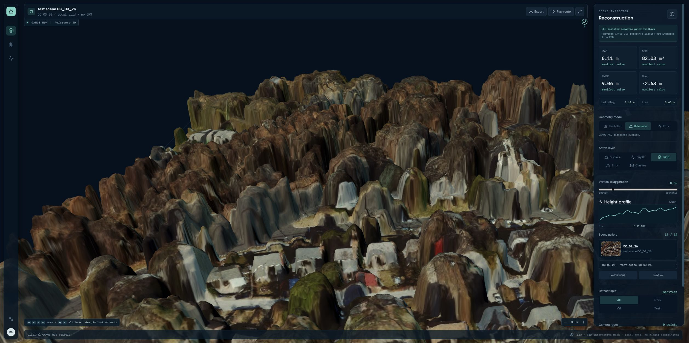
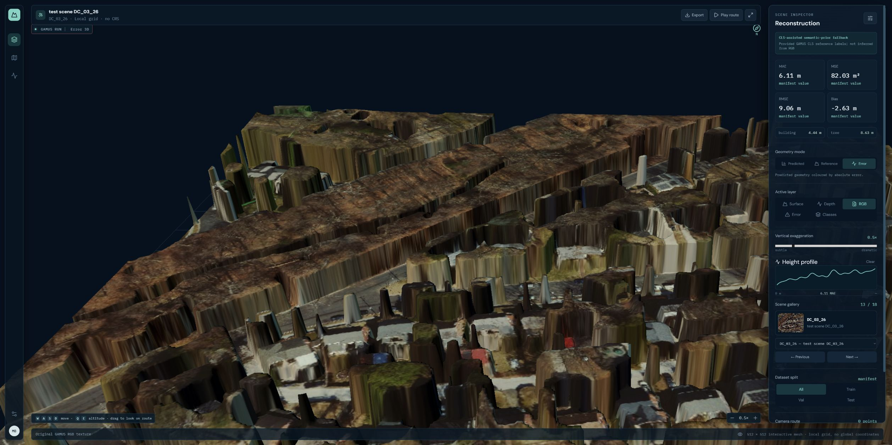
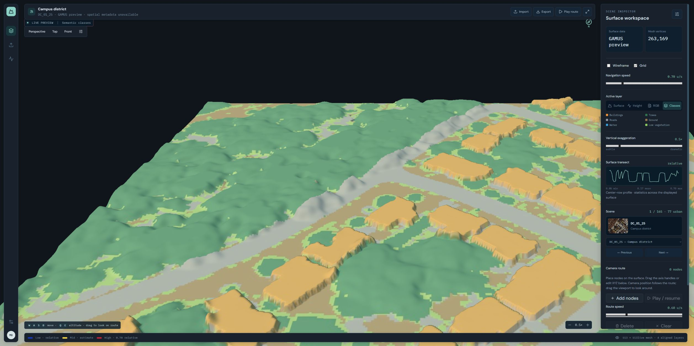
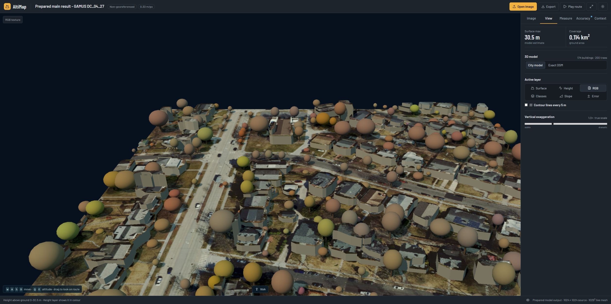

# AltiMap project journey

This history comes from branch code, saved test reports and older viewers that we rebuilt and opened.
It was written on **5 October 2026**. No application code changed.

Some branches tried different ideas at the same time. A better-looking image does not prove better
heights. Tests using different images, training labels or quality settings are not a fair comparison.

## Snapshot map

| Path | Inspected snapshot | Evidence scope |
|---|---|---|
| Mark-1 | [97c078d](https://github.com/ManasBytes/altimap/commit/97c078d47474e7b7cd4c27a43aa711090526b137) | Existing manifest/code; rebuilt historical UI; no new inference |
| Biplab feature branch | [17a8016](https://github.com/ManasBytes/altimap/commit/17a801645481c46be0d5d4522b17e2968ec1590a) | Existing training documents/code; rebuilt reference gallery |
| Dilavesh height stack | [c7142f9](https://github.com/ManasBytes/altimap/commit/c7142f9424b2213bcb096a3850ff1d3c196c8187) | Implementation and historical model/evaluation records |
| Tested main | [84136c4](https://github.com/ManasBytes/altimap/commit/84136c4013837f141624ed62a1d6cff80f52c05c) | Corrected fusion reports and real-upload verification |
| Newer teammate experiments | [e5837d0](https://github.com/ManasBytes/altimap/commit/e5837d0d25a13909785e3f6d1e43d37b7d83951d) | Non-GPU tests, build and prepared-scene UI smoke test only |

Branch names can move. These commit links identify what was actually inspected.

## 1. Early depth and direct-elevation experiments

A general depth model can produce a surface from one image. That made it a useful starting idea.
However, satellite images looking straight down differ from the angled everyday photographs
these models commonly see.

Our DA3 investigation found strong artificial ramps in many overhead predictions. The
[domain-gap report](https://github.com/ManasBytes/altimap/blob/6f74aa3f1aeb1bace6bdf7a847b53f53f8257647/docs/superpowers/spikes/2026-08-24-da3-nadir-domain-gap.md)
documents this diagnostic. It is not an independent metric-height benchmark.

A separate [direct DEM renderer](https://github.com/ManasBytes/altimap/blob/f0ca34a8af443efe4fd5eea378df5b7ca2a72a1a/viewer/export_dem_direct.py)
draped RGB imagery onto public elevation, optionally adding known-height mapped buildings.
It demonstrated useful geospatial alignment and visualization, but did not predict roof heights
from RGB. A dense mesh can interpolate a coarse DEM; it cannot create missing measured detail.

**Lesson:** distinguish rendering reference elevations from estimating unknown heights.

## 2. Rishabh_prototype_Mark_1: small GAMUS prototype

Mark-1 prepared six training, six validation and six test scenes. Its intended path used
Depth Anything V2 and a RDAH-Net height model whose weights were not changed.
That setup did not produce useful heights. It was a failed attempt to reproduce the method,
not proof that the research method cannot work.

The visible backup method was different:

```text
training reference heights + training class labels
    → fit typical height per class

RGB → relative depth → normalized depth
supplied scene CLS labels + fitted class heights + normalized depth
    → prepared fallback height surface
```

The backup method used approximately:

```text
height = training_class_median[supplied_class] × (0.65 + 0.70 × normalized_depth)
```

Test/validation reference heights were not used to fit those typical heights, but their **provided
class labels were inputs**. This is not a test using the colour image alone. See the snapshot's
[semantic prior](https://github.com/ManasBytes/altimap/blob/97c078d47474e7b7cd4c27a43aa711090526b137/mark1/semantic_prior.py)
and [application script](https://github.com/ManasBytes/altimap/blob/97c078d47474e7b7cd4c27a43aa711090526b137/mark1/apply_semantic_prior.py).

The manifest's pooled validation MAE/RMSE were approximately 4.01/6.27 m and test MAE/RMSE
6.45/9.25 m. These cannot be compared directly with main's much larger RGB-only benchmark.

### Replayed historical scene: DC_03_26

| Prepared prediction | Reference | Error |
|---|---|---|
|  |  |  |

Captured from a rebuilt copy of snapshot 97c078d on 5 October. The scene's stored MAE is 6.11 m,
RMSE 9.06 m; these are scene metrics, not split averages. The display uses 0.5× vertical
exaggeration. No fresh RDAH inference or retraining was performed for these captures.

**Carried forward:** prediction/reference/error views, metric scales and honest provenance.
**Not carried forward as the final estimator:** reference-class-assisted fallback.

## 3. biplab-feat: terrain workspace and supervised surface learning

The terrain workspace organized RGB, height, depth and displacement images into explorable scenes.
Its built-in GAMUS previews contain reference heights; opening one is not running a height model.

The branch also developed a separate supervised ResNet34/U-Net-style model with segmentation
and above-ground-height heads. Training records describe 55 training, 55 validation and 55 test
scenes, with semantic losses and a height loss. Reported test MAE/RMSE were 3.71/5.60 m.
Those records are historical claims, not a freshly rerun benchmark in this documentation exercise.

Inference code uses overlapping image windows; prepared grayscale/displacement textures serve
the renderer, while scientific heights and display regularization must remain distinct.
The branch's custom trained checkpoint was not available in this replay, so only the **reference
workspace** was tested and photographed.

| Earlier textured reference terrain | Earlier class layer |
|---|---|
|  |  |

Captured from snapshot 17a8016. Scene DC_01_25, local grid, spatial metadata unavailable.
The class-layer image is a prepared reference visualization, not proof of inference accuracy.

**Carried forward:** a strong interaction/visualization base and multi-layer inspection.
**Caution:** a gallery asset, a predicted class map and a measured height map are different things.

## 4. dilavesh-new: remote-sensing height supervision

This path replaced raw relative depth as the final estimator with RS3DAda/DINOv2 features and a
DPT height/semantic decoder fine-tuned on GAMUS. Height output is above-ground nDSM; semantic
classes are predicted from RGB instead of supplied with every upload.

```text
v1 general height + semantic model
    ├─ predicted buildings → v1/v2 building combination
    ├─ extensive predicted forest → optional CHMv2 canopy specialist
    └─ remaining pixels → v1
```

v1 uses height L1 + 0.5 gradient L1 + 0.2 semantic cross-entropy. v2 uses more encoder adaptation,
height-weighted supervision and additional tall-building examples. CHMv2 is a separate optional
forest model; local main upload checks did not include its weights.

For georeferenced RGB inputs, CRS/pixel placement locates a public DEM. The current DSM method
subtracts an approximate local mean of predicted detail before adding high-resolution detail.
This is not a surveyed DTM or exact fusion on the native Copernicus grid.

**Carried forward:** a task-specific estimator, predicted semantics, selective specialists,
float height rasters and independent reference evaluation.

## 5. Tested updated branch → current main

The earlier updated branch was validated and promoted; main now identifies the tested snapshot
84136c4. Newer commits on the similarly named teammate branch were deliberately not included.

### A measured production decision

Five fixed building weights and five soft routing variants were evaluated on all 859 validation
tiles. The selected weight was then confirmed on 2,861 test tiles, with a separate 24-tile TTA
check. Invalid −5 m reference sentinels were excluded.

| Test route | Overall RMSE | Building RMSE |
|---|---:|---:|
| v1 only | 3.9623 m | 5.9289 m |
| Previous 50/50 | 3.7573 m | 5.2308 m |
| Current 25/75 | **3.6972 m** | **4.9934 m** |

This is a same-data comparison, unlike the cross-branch historical numbers.
See [the public evidence](evidence/README.md) and
[adoption record](evaluation/BUILDING_FUSION_075_REPORT.md).

Main also fixes undefined-correlation JSON failures, makes secondary DEM comparison opt-in,
and repaints the viewer after camera changes. Saved real-upload verification covers ten scenes
and 17 raster exports. Complete accuracy records and the missing local CHMv2 are documented
separately; the selected presentation images must not imply uniformly accurate reconstruction.


**Current main is the baseline to beat**, including its limitations.

## 6. Newer updated-dilavesh-new: exploratory, not approved production

Snapshot e5837d0 adds inspector tabs and a saved-scene demo bundle, alongside changes to roof/crown
presentation, mapped context and scale handling. Some commits also change numeric DSM behavior;
they are not all harmless cosmetic features.

These features deserve selective investigation, not automatic adoption. This branch diverged
before main's final JSON-safety/opt-in-comparison fixes. A green non-GPU suite does not establish
that its upload failure paths or geospatial reconstruction are correct.

### What we actually tested

- Clean lockfile install and frontend build.
- 141 passing non-GPU tests, one skipped.
- Its existing demo-bundle CLI, using a **previously verified main result** for GAMUS DC_04_27.
- Saved-scene loading, View/Accuracy tabs, visible texture and geometry.
- Orbit drag produced a changed canvas capture; no browser error entries were recorded.

Live inference was disabled in this isolated preview. No new height accuracy, model gain,
GPU compatibility or online mapped-context reliability was established.

| New inspector: accuracy tab | New inspector: view tab |
|---|---|
|  |  |

The displayed RMSE 2.79 m and MAE 1.65 m belong to the **stored main result**, not to a new model
inference by this experimental branch. Roof blocks and tree crowns are simplified geometry.

### Additional team-provided city-context screenshot


The team supplied this additional image for the documentation: Pittsburgh bridges, 0.60 m/pixel,
city geometry and OpenStreetMap-assisted context. Its precise capture commit and inference accuracy
were not independently verified. This image was not produced by our prepared-scene smoke test above;
it illustrates newer branch work, not a validated feature in main.

## Replay checks and their limits

| Snapshot | Non-GPU pytest | Frontend build | Browser check |
|---|---|---|---|
| Mark-1 97c078d | 51 passed, 1 skipped | Passed | Prepared prediction/reference/error |
| Biplab 17a8016 | 52 passed, 7 skipped | Passed | Reference workspace and classes |
| Experimental e5837d0 | 141 passed, 1 skipped | Passed | Saved main result, tabs and orbit |

Tests ran in the existing torch-free environment; frontend builds used each snapshot's lockfile.
These checks validate the documented replay scope, not a full neural-network benchmark.
No historical/custom weights were silently substituted to imply successful inference.

The existing main app remained separate on port 8000 throughout; previews used 8002–8004.
Documentation evidence is independent of running those preview servers again.

## Next chapter

Preserve current main and its raw evaluation artifacts. Compare RDAH-Net, Depth2Elevation and
satellite-pretrained DINOv3 features on identical data, GSD, masks and metrics. Evaluate raw nDSM
first; then assess absolute DSM and visualization separately.

Adopt a candidate only after it improves results on a separate test set, runs fast enough,
has suitable licence terms and passes the existing checks.
Reproducing Mark-1's failed raw model correctly is a research task, not a reason to claim a victory
from a paper's results or from reference-assisted screenshots.

[Return to README](../README.md) · [Evidence index](evidence/README.md)
